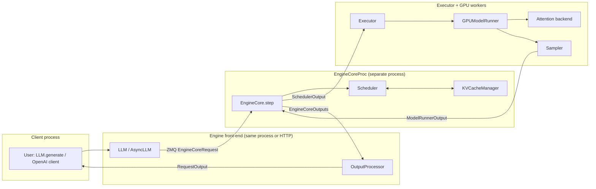
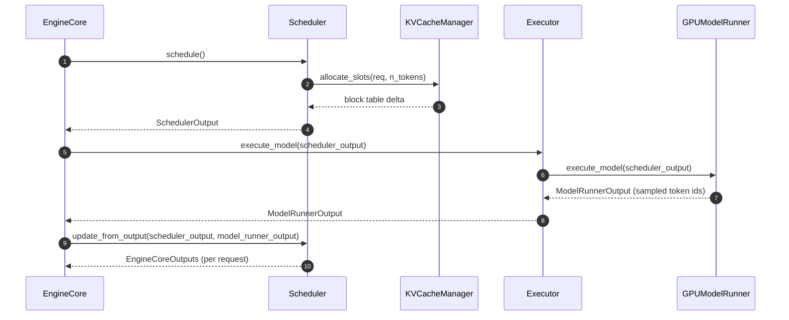
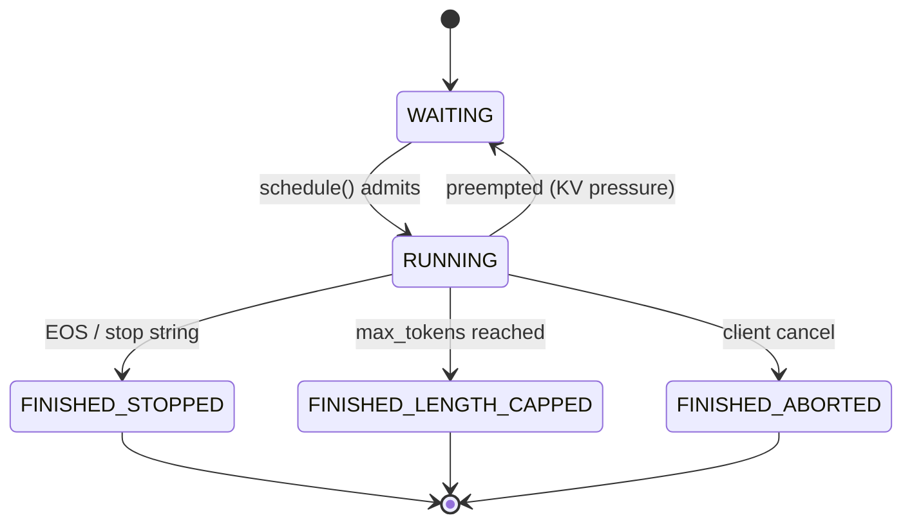
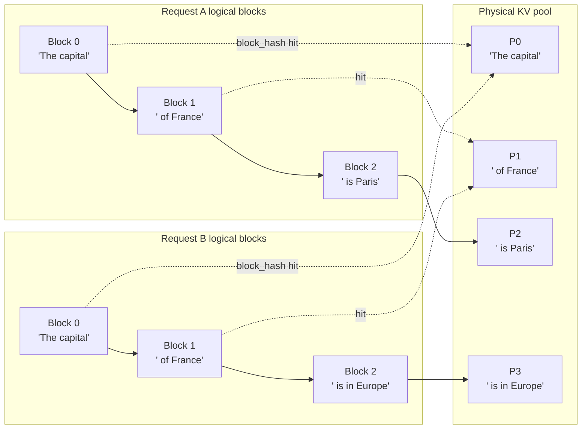
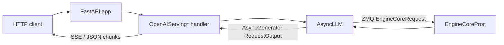

# vLLM Hacker's Guide

> **Scope:** a code-first tour of the **V1 engine** as it exists on
> `vllm-project/vllm` **v0.22.0** (released May 30, 2026). Inspired by the
> September 2025 blog post
> [*Inside vLLM: Anatomy of a High-Throughput LLM Inference System*](https://blog.vllm.ai/2025/09/05/anatomy-of-vllm.html),
> updated to the current code and paired with a `hacks/` directory of
> runnable scripts that exercise each subsystem in isolation.
>
> If you only want one sentence: every request enters via
> [`vllm/entrypoints/llm.py:66`](vllm/entrypoints/llm.py) (`class LLM`),
> is forwarded into the V1 engine, gets scheduled by
> [`vllm/v1/core/sched/scheduler.py:64`](vllm/v1/core/sched/scheduler.py)
> (`class Scheduler`), is executed by
> [`vllm/v1/worker/gpu_model_runner.py:415`](vllm/v1/worker/gpu_model_runner.py)
> (`class GPUModelRunner`), and streams back through
> [`vllm/v1/engine/output_processor.py:110`](vllm/v1/engine/output_processor.py)
> (`class OutputProcessor`). Everything else is detail.

---

## Table of contents

1. [How to read this guide](#1-how-to-read-this-guide)
2. [What's new in v0.22.0](#2-whats-new-in-v0220)
3. [30-second architecture](#3-30-second-architecture)
4. [`LLM.generate()` — the entry point](#4-llmgenerate--the-entry-point)
5. [Input processing & tokenization](#5-input-processing--tokenization)
6. [EngineCore: the step loop](#6-enginecore-the-step-loop)
7. [The Scheduler](#7-the-scheduler)
8. [Paged attention & the KV cache manager](#8-paged-attention--the-kv-cache-manager)
9. [KV cache sizing & memory profiling](#9-kv-cache-sizing--memory-profiling)
10. [Multi-tier KV cache offloading](#10-multi-tier-kv-cache-offloading)
11. [Continuous batching, in code](#11-continuous-batching-in-code)
12. [Attention backends](#12-attention-backends)
13. [Sampling](#13-sampling)
14. [Request lifecycle & output](#14-request-lifecycle--output)
15. [Model loading & the model registry](#15-model-loading--the-model-registry)
16. [Workers & executors](#16-workers--executors)
17. [Model Runner V2](#17-model-runner-v2)
18. [CUDA graphs & torch.compile](#18-cuda-graphs--torchcompile)
19. [Multi-GPU / distributed](#19-multi-gpu--distributed)
20. [Advanced features](#20-advanced-features)
21. [DeepSeek V4](#21-deepseek-v4)
22. [The serving layer](#22-the-serving-layer)
23. [Rust frontend](#23-rust-frontend)
24. [Where to go next](#24-where-to-go-next)
25. [Hands-on hacks](#25-hands-on-hacks)
26. [Contributing](#26-contributing)

---

## 1. How to read this guide

**Prerequisites.** A working PyTorch install, a CUDA-capable GPU helps
but is not required for most of the `hacks/` scripts, and the
contributor environment described in [`AGENTS.md`](AGENTS.md):

```bash
curl -LsSf https://astral.sh/uv/install.sh | sh
uv venv --python 3.12 && source .venv/bin/activate
VLLM_USE_PRECOMPILED=1 uv pip install -e . --torch-backend=auto
uv pip install -r requirements/lint.txt && pre-commit install
```

**Running example.** Throughout the guide we trace this five-line
program through the engine:

```python
from vllm import LLM, SamplingParams

llm = LLM(model="facebook/opt-125m")
outs = llm.generate(["The capital of France is"], SamplingParams(max_tokens=8))
print(outs[0].outputs[0].text)
```

Each section ends with a **▶ Try it** pointer to a script in `hacks/`
that lets you exercise the component **without booting the whole
engine** — no model weights, no CUDA in most cases.

**Conventions.** Code references use the form
`vllm/path/to/file.py:LINE` and link into the tree at the
**current** SHA on disk. Line numbers drift; treat them as hints and
search by the named symbol if a line moves. (The companion
[vLLM Explorer](https://phi9t.github.io/vllm/) re-grounds every reference
by symbol-grep, so its "Component Deep Dive" stays accurate even when
lines shift.)

---

## 2. What's new in v0.22.0

v0.22.0 (May 30, 2026) landed **459 commits from 230 contributors**. The
changes that matter most for a hacker reading the engine:

- **🐋 DeepSeek V4 matured into a dedicated package**
  ([`vllm/models/deepseek_v4/`](vllm/models/deepseek_v4/)): NVFP4 fused
  MoE, full + piecewise CUDA graphs, MTP speculative decoding on ROCm,
  more fused kernels, and ROCm parity. Registered as `DeepseekV4ForCausalLM`
  at [`vllm/model_executor/models/registry.py:101`](vllm/model_executor/models/registry.py).
  See §21.
- **🦀 Experimental Rust frontend moved in-tree** ([`rust/`](rust/)) — a
  Cargo workspace for the serving front-end / control plane. See §23.
- **🛠️ Model Runner V2** — a next-gen runner under the new
  [`vllm/v1/worker/gpu/model_runner.py`](vllm/v1/worker/gpu/model_runner.py)
  subpackage, with oracle backend selection (Qwen3). See §17.
- **⚡ Batch invariance** — a Cutlass FP8 path
  ([`vllm/model_executor/layers/batch_invariant.py`](vllm/model_executor/layers/batch_invariant.py))
  giving a reported ~28.9% end-to-end latency win, compile-mode support on
  SM80, and an NVFP4 Cutlass linear path. Bit-for-bit reproducible matmuls
  regardless of batch composition.
- **🧊 Multi-tier KV cache offloading**
  ([`vllm/v1/kv_offload/`](vllm/v1/kv_offload/)) — spill KV blocks from GPU
  HBM to host RAM to disk. See §10.
- **🟢 NVIDIA Blackwell:** FlashInfer MoE + FP4 GEMM for SM120/121;
  per-tensor FP8 CUTLASS on SM12.1. **🔴 AMD ROCm:** DeepSeek V4.
- **🆕 New architectures:** MiniCPM-V 4.6, InternS2 Preview, OpenVLA;
  custom-callable spec-decode proposers; broader tool-calling.

**Before you upgrade.** Pin churn around `nvidia-cutlass-dsl` (now
`==4.5.2` with the `[cu13]` extra on CUDA 13) and the NIXL connector
(`1.x`); the V1 default CUDA-graph mode is `FULL_AND_PIECEWISE` (§18).
Full notes: the
[v0.22.0 release](https://github.com/vllm-project/vllm/releases/tag/v0.22.0).

---

## 3. 30-second architecture



The boxes correspond to concrete files (v0.22.0 lines):

| Box | File | Symbol |
| --- | --- | --- |
| `LLM` / `AsyncLLM` | [`vllm/entrypoints/llm.py:66`](vllm/entrypoints/llm.py) / [`vllm/v1/engine/async_llm.py:70`](vllm/v1/engine/async_llm.py) | `class LLM` / `class AsyncLLM` |
| `EngineCoreProc` | [`vllm/v1/engine/core.py:835`](vllm/v1/engine/core.py) | `class EngineCoreProc` |
| `EngineCore.step` | [`vllm/v1/engine/core.py:428`](vllm/v1/engine/core.py) | `def step` |
| `Scheduler` | [`vllm/v1/core/sched/scheduler.py:64`](vllm/v1/core/sched/scheduler.py) | `class Scheduler` |
| `KVCacheManager` | [`vllm/v1/core/kv_cache_manager.py:110`](vllm/v1/core/kv_cache_manager.py) | `class KVCacheManager` |
| `Executor` | [`vllm/v1/executor/abstract.py:37`](vllm/v1/executor/abstract.py) | `class Executor` (ABC) |
| `GPUModelRunner` | [`vllm/v1/worker/gpu_model_runner.py:415`](vllm/v1/worker/gpu_model_runner.py) | `class GPUModelRunner` |
| `Sampler` | [`vllm/v1/sample/sampler.py:20`](vllm/v1/sample/sampler.py) | `class Sampler` |
| `OutputProcessor` | [`vllm/v1/engine/output_processor.py:110`](vllm/v1/engine/output_processor.py) | `class OutputProcessor` |

---

## 4. `LLM.generate()` — the entry point

The user-facing `LLM` wraps an inner `LLMEngine`, which in V1 is a thin
adapter that talks to an `EngineCore` (either in-process or over ZMQ).

- [`vllm/entrypoints/llm.py:66`](vllm/entrypoints/llm.py) — `class LLM`.
- [`vllm/entrypoints/llm.py:422`](vllm/entrypoints/llm.py) — `def generate(...)`. It:
  1. Validates prompts / sampling params.
  2. Calls `_validate_and_add_requests` which tokenizes each prompt and
     calls `self.llm_engine.add_request(...)`.
  3. Pumps `_run_engine()` until every added request finishes, then
     returns a list of `RequestOutput` ordered by submission.
- [`vllm/v1/engine/llm_engine.py:47`](vllm/v1/engine/llm_engine.py) —
  `class LLMEngine`, the V1 sync wrapper.
- [`vllm/v1/engine/async_llm.py:70`](vllm/v1/engine/async_llm.py) —
  `class AsyncLLM`, the async sibling used by the OpenAI server. Its
  `add_request` tokenizes and forwards an `EngineCoreRequest`; its
  `generate` is an `AsyncGenerator[RequestOutput, None]` that yields each
  incremental output until the request is `FINISHED_*`.

**Offline vs. online.** Both `LLMEngine` and `AsyncLLM` ultimately push
`EngineCoreRequest` objects over the same boundary. The difference is
back-pressure and threading: `LLMEngine` drives the loop synchronously,
`AsyncLLM` yields control to asyncio between steps.

▶ Try it: [`hacks/01_llm_smoke.py`](hacks/01_llm_smoke.py) (loads a real
model — gated by `VLLM_HACK_RUN_MODEL=1`).

---

## 5. Input processing & tokenization

Before the scheduler ever sees a request, the front-end turns a prompt
into an `EngineCoreRequest`. The path:

```
prompt (str / chat / tokens / multimodal)
   │  tokenizer  (vllm/transformers_utils/tokenizer.py)
   ▼
token_ids
   │  InputPreprocessor  (vllm/inputs/preprocess.py:48)   ← prompt-type
   ▼                                                         normalization, MM
ProcessorInputs
   │  InputProcessor     (vllm/v1/engine/input_processor.py:36)
   ▼
EngineCoreRequest        (vllm/v1/engine/__init__.py:80)
```

- [`vllm/inputs/preprocess.py:48`](vllm/inputs/preprocess.py) —
  `class InputPreprocessor`. Normalizes the many prompt shapes (raw text,
  token ids, `{"prompt": ...}`, chat turns, multimodal) into a single
  internal representation and runs the tokenizer.
- [`vllm/v1/engine/input_processor.py:36`](vllm/v1/engine/input_processor.py)
  — `class InputProcessor`. The V1 front-end stage that assigns the request
  id, attaches sampling/pooling params and LoRA, and emits the
  `EngineCoreRequest` that crosses into the engine.
- [`vllm/v1/engine/__init__.py:80`](vllm/v1/engine/__init__.py) —
  `class EngineCoreRequest`. The `msgspec.Struct` the scheduler reads:
  `request_id`, `prompt_token_ids`, `mm_features`, `sampling_params`,
  `arrival_time`, `lora_request`, `cache_salt`, …

The same byte-level tokenization is what the companion
[vLLM Explorer's Data mode](https://phi9t.github.io/vllm/) visualizes
piece-by-piece.

▶ Try it: [`hacks/14_input_processor.py`](hacks/14_input_processor.py) —
prompt → token ids → `EngineCoreRequest` shape, no model.

---

## 6. EngineCore: the step loop

`EngineCore` ([`vllm/v1/engine/core.py:94`](vllm/v1/engine/core.py))
owns the scheduler, the KV cache manager, and the executor. It exposes
two methods worth knowing:

- `add_request` ([line 337](vllm/v1/engine/core.py)) — validates inputs,
  builds a `Request`, and pushes it into the scheduler's waiting queue.
- `step` ([line 428](vllm/v1/engine/core.py)) — one tick of the engine.
  Always three stages:



`EngineCoreProc` ([line 835](vllm/v1/engine/core.py)) is the
multi-process variant; its `run_busy_loop`
([line 1193](vllm/v1/engine/core.py)) sits on a ZMQ socket, decodes
client requests, calls `step()`, and ships `EngineCoreOutputs` back. In
single-process / "uniproc" mode `LLMEngine` drives `step()` directly.

▶ Try it: [`hacks/12_engine_step.py`](hacks/12_engine_step.py) — drives
one full engine step end-to-end with a stub model, **zero CUDA**.

---

## 7. The Scheduler

The scheduler is the single most important file in V1.

- [`vllm/v1/core/sched/scheduler.py:64`](vllm/v1/core/sched/scheduler.py)
  — `class Scheduler(SchedulerInterface)`.
- [`vllm/v1/core/sched/interface.py`](vllm/v1/core/sched/interface.py)
  — the abstract base (`SchedulerInterface`).
- [`vllm/v1/core/sched/output.py`](vllm/v1/core/sched/output.py) —
  `SchedulerOutput` (the contract with the executor).

### What `schedule()` does

`Scheduler.schedule()`
([line 329](vllm/v1/core/sched/scheduler.py)) picks the next batch.
Mental model:

1. **Decode pass.** Walk every request in `self.running`; reserve one
   new KV block slot per request if needed (cap by token budget).
2. **Prefill pass.** Promote waiting requests into running if there's
   leftover budget and free KV blocks. If chunked prefill is on, only
   chunk a prefix of the prompt that fits the remaining budget.
3. **Emit `SchedulerOutput`** — flat lists of token ids, slot mappings,
   and metadata that the worker turns straight into a single tensor.

### What `update_from_output()` does

`Scheduler.update_from_output()`
([line 1283](vllm/v1/core/sched/scheduler.py)) is the **feedback path**.
It appends sampled tokens to each running request, checks stop
conditions (EOS, `max_tokens`, stop strings), and frees KV blocks for
finished requests via `KVCacheManager.free`.

### Request status



Enum lives at [`vllm/v1/request.py:315`](vllm/v1/request.py).

▶ Try it:
- [`hacks/05_scheduler_step.py`](hacks/05_scheduler_step.py) — single
  scheduling tick with three synthetic requests.
- [`hacks/06_chunked_prefill.py`](hacks/06_chunked_prefill.py) — long
  prompt, small budget, watch the prompt slice.

---

## 8. Paged attention & the KV cache manager

Paged attention turns the KV cache into a **block allocator**: each
request owns a "block table" mapping logical block indices to physical
GPU memory blocks. Identical prefixes share physical blocks.

### Key files

- [`vllm/v1/core/kv_cache_manager.py:110`](vllm/v1/core/kv_cache_manager.py)
  — `class KVCacheManager`. The high-level API:
  - `allocate_slots(request, num_tokens)` ([line 236](vllm/v1/core/kv_cache_manager.py))
    — return a delta of newly assigned blocks; raises if the pool is
    full.
  - `free(request)` ([line 429](vllm/v1/core/kv_cache_manager.py)) —
    drop reference counts so blocks can be reused.
- [`vllm/v1/core/block_pool.py:130`](vllm/v1/core/block_pool.py) —
  `class BlockPool`. The low-level free-list / LRU implementation.
- [`vllm/v1/core/kv_cache_utils.py`](vllm/v1/core/kv_cache_utils.py)
  — `BlockHash`, `BlockHashWithGroupId`, and
  `get_request_block_hasher(...)`, the factory that produces a
  per-request hasher used for prefix-cache lookups.

### Prefix sharing, visually



The hash function (`get_request_block_hasher`) hashes the full token
sequence ending at each block boundary, with a stable per-cache-group
salt (`BlockHashWithGroupId`) so multiple cache groups (e.g. cross-
attention KV) can share the pool without collision.

### Eviction policy

When the pool runs out, the `BlockPool` evicts the **least-recently-
used unreferenced block** ([`block_pool.py`](vllm/v1/core/block_pool.py)
`free_blocks` / `_evict_*` helpers). Reference counts are bumped each
time a logical block points at a physical block, so blocks shared by
live requests are never evicted.

▶ Try it:
- [`hacks/03_kv_cache_manager.py`](hacks/03_kv_cache_manager.py) —
  allocate / share / free synthetic requests.
- [`hacks/04_prefix_cache_hashing.py`](hacks/04_prefix_cache_hashing.py)
  — show two prompts hash to the same prefix blocks.

---

## 9. KV cache sizing & memory profiling

A natural question: *how big is my KV cache, and where does
`gpu_memory_utilization` actually go?* vLLM answers it at startup with a
profiling run, not a formula.

1. **Profile.** The worker runs a dummy forward at the max batch shape and
   measures peak memory:
   [`vllm/v1/worker/gpu_worker.py:354`](vllm/v1/worker/gpu_worker.py) —
   `def determine_available_memory(...)`. Free-for-KV bytes ≈
   `total · gpu_memory_utilization − weights − activations − cudagraphs`.
2. **Spec.** Each attention layer declares a `KVCacheSpec`
   ([`vllm/v1/kv_cache_interface.py:82`](vllm/v1/kv_cache_interface.py);
   `FullAttentionSpec` at [line 175](vllm/v1/kv_cache_interface.py)) whose
   `page_size_bytes` is the bytes one block costs.
3. **Blocks.** `get_kv_cache_configs(...)`
   ([`vllm/v1/core/kv_cache_utils.py:1922`](vllm/v1/core/kv_cache_utils.py))
   divides the free bytes by the per-block cost to get `num_gpu_blocks`,
   reconciling layers that share a pool.

The arithmetic underneath, for a standard attention layer:

```
bytes_per_token = 2 (K and V) · num_layers · num_kv_heads · head_dim · dtype_bytes
block_bytes     = bytes_per_token · block_size            # block_size default 16, vllm/config/cache.py:47
num_gpu_blocks  = floor(free_kv_bytes / block_bytes)
kv_tokens       = num_gpu_blocks · block_size             # total tokens of KV you can hold
```

GQA shrinks `num_kv_heads`; MLA stores a single compressed latent per
token instead (§21), which is why DeepSeek's KV cache is so much smaller.

▶ Try it: [`hacks/15_kv_cache_sizing.py`](hacks/15_kv_cache_sizing.py) —
the calculator above for several real configs, no GPU.

---

## 10. Multi-tier KV cache offloading

New in v0.22.0: when the GPU pool is full, KV blocks can be **spilled to a
slower tier** instead of evicted, then faulted back on a prefix hit. The
tier hierarchy in practice is **GPU HBM → host RAM → disk/NVMe**, and the
latency cliff shows up on the *fault-back* path — a host-RAM hit is a
PCIe copy (tens of µs), an NVMe hit is an I/O round-trip (hundreds of µs to
ms), so offloading pays off only when the recomputation it avoids is more
expensive than the copy back.

- [`vllm/v1/kv_offload/base.py:110`](vllm/v1/kv_offload/base.py) —
  `class OffloadingManager(ABC)`: `lookup` / `prepare_load` / `touch` /
  `complete_load` / `prepare_store` — the contract for "is this block in a
  lower tier, and move it."
- [`vllm/v1/kv_offload/base.py:331`](vllm/v1/kv_offload/base.py) —
  `class OffloadingSpec(ABC)`; built via
  [`factory.py:17`](vllm/v1/kv_offload/factory.py) `OffloadingSpecFactory`.
- [`vllm/v1/kv_offload/tiering/`](vllm/v1/kv_offload/tiering/) — the
  multi-tier manager (`manager.py`, `spec.py`); the copy worker is in
  [`worker/worker.py`](vllm/v1/kv_offload/worker/worker.py); knobs live in
  [`vllm/config/offload.py`](vllm/config/offload.py).

This rides on the same `BlockHash` prefix machinery as §8 — an offloaded
block is keyed by the same hash, so a later request with a shared prefix
can fault it back instead of recomputing. Cross-tier KV transfer between
*engines* (disaggregated prefill) is the related `kv_transfer` connector
family (§19).

▶ Try it: revisit [`hacks/03_kv_cache_manager.py`](hacks/03_kv_cache_manager.py)
— the block-hash + ref-count mechanics offloading reuses.

---

## 11. Continuous batching, in code

V1 implements "continuous batching" not by per-request batching, but by
**flattening the entire batch into a single 1-D token sequence per
step**. The trick is in the `SchedulerOutput`:

- A single concatenated `token_ids` tensor for the step.
- A `query_start_loc` / `seq_lens` pair telling the attention kernel
  where each request's tokens live in the flat tensor.
- Block tables packed as a 2-D tensor `(num_reqs, max_blocks)`.

You can see this packing in
[`vllm/v1/worker/gpu_input_batch.py`](vllm/v1/worker/gpu_input_batch.py)
(it builds the actual tensors) and read about why this is correct in
[`docs/design/paged_attention.md`](docs/design/paged_attention.md). The
attention backends (next section) accept this layout natively.

**Why this matters for hackers:** prefill and decode share the *same*
forward pass. There is no separate "prefill model" — the scheduler
just packs prefill tokens and decode tokens into one tensor and the
attention kernel handles both via the block table.

▶ Try it: [`hacks/16_batch_packing.py`](hacks/16_batch_packing.py) —
build `query_start_loc` / `seq_lens` / `slot_mapping` from a synthetic
mixed prefill+decode batch, no CUDA.

---

## 12. Attention backends

Attention backends are selected at engine init based on hardware,
dtype, head size, and whether you've requested anything fancy
(MLA, mamba, etc.).

- [`vllm/v1/attention/backend.py`](vllm/v1/attention/backend.py) —
  `AttentionBackend` (registry surface) and `AttentionImpl` (kernel
  base class).
- [`vllm/v1/attention/selector.py:52`](vllm/v1/attention/selector.py) —
  `def get_attn_backend(...)`. Reads
  `VLLM_ATTENTION_BACKEND` env var, dtype, device, and head size, then
  picks one of:

| Backend file | Use case |
| --- | --- |
| [`backends/flash_attn.py`](vllm/v1/attention/backends/flash_attn.py) | NVIDIA, generic |
| [`backends/flashinfer.py`](vllm/v1/attention/backends/flashinfer.py) | NVIDIA, lower decode latency; MoE + FP4 GEMM on Blackwell |
| [`backends/triton_attn.py`](vllm/v1/attention/backends/triton_attn.py) | Triton kernels, broader hw |
| [`backends/flex_attention.py`](vllm/v1/attention/backends/flex_attention.py) | PyTorch 2.5+ FlexAttention |
| [`backends/rocm_aiter_fa.py`](vllm/v1/attention/backends/rocm_aiter_fa.py), [`rocm_attn.py`](vllm/v1/attention/backends/rocm_attn.py) | AMD ROCm |
| [`backends/cpu_attn.py`](vllm/v1/attention/backends/cpu_attn.py) | CPU fallback |
| [`backends/mla/`](vllm/v1/attention/backends/mla/) | Multi-head Latent Attention (DeepSeek) |

For bit-exact results regardless of how requests batch together, v0.22.0
adds a **batch-invariant** path
([`vllm/model_executor/layers/batch_invariant.py`](vllm/model_executor/layers/batch_invariant.py))
that routes matmuls through reduction-order-stable Cutlass FP8 kernels.

Cross-link: [`docs/design/attention_backends.md`](docs/design/attention_backends.md)
covers what authoring a new backend looks like.

▶ Try it: [`hacks/09_attention_backend_select.py`](hacks/09_attention_backend_select.py)
— print the backend chosen for various `(head_size, dtype, device)` tuples.

---

## 13. Sampling

[`vllm/v1/sample/sampler.py:20`](vllm/v1/sample/sampler.py) defines
`class Sampler(nn.Module)`. It receives raw logits from the
`GPUModelRunner`, runs them through a fixed pipeline:

1. Apply logits processors (from
   [`vllm/v1/sample/logits_processor/`](vllm/v1/sample/logits_processor/)).
2. Apply penalties
   ([`vllm/v1/sample/ops/penalties.py`](vllm/v1/sample/ops/penalties.py)).
3. Apply bad-words mask
   ([`ops/bad_words.py`](vllm/v1/sample/ops/bad_words.py)).
4. Apply temperature / top-k / top-p
   ([`ops/topk_topp_sampler.py`](vllm/v1/sample/ops/topk_topp_sampler.py)).
5. Sample (multinomial or argmax depending on temperature).
6. Compute logprobs if requested
   ([`ops/logprobs.py`](vllm/v1/sample/ops/logprobs.py)).

For speculative decoding there is a parallel
[`vllm/v1/sample/rejection_sampler.py`](vllm/v1/sample/rejection_sampler.py)
that accepts/rejects drafts from a small proposer model.

Cross-link: [`docs/design/logits_processors.md`](docs/design/logits_processors.md).

▶ Try it:
- [`hacks/07_sampler.py`](hacks/07_sampler.py) — hand-crafted logits
  through every knob.
- [`hacks/08_logits_processor.py`](hacks/08_logits_processor.py) — a
  20-line custom processor that bans one token.

---

## 14. Request lifecycle & output

A `Request` ([`vllm/v1/request.py:59`](vllm/v1/request.py)) carries
everything about an in-flight generation: tokens so far, sampling
params, multi-modal inputs, structured-output state, KV block table,
arrival time, and current `RequestStatus`
([line 315](vllm/v1/request.py)).

On the way *out*,
[`vllm/v1/engine/output_processor.py:110`](vllm/v1/engine/output_processor.py)
— `class OutputProcessor` — owns one
`RequestOutputCollector` per active request. It:

- Detokenizes new token ids (handles partial-utf8 boundaries).
- Stitches streaming chunks for the OpenAI API.
- Decides when a request is "done from the client's perspective",
  even if the engine kept going for a step (e.g. EOS-on-the-wire).

▶ Try it:
- [`hacks/02_request_lifecycle.py`](hacks/02_request_lifecycle.py) —
  walk a `Request` through the `RequestStatus` state machine.
- [`hacks/10_output_processor.py`](hacks/10_output_processor.py) —
  drive `OutputProcessor` with synthetic engine outputs.

---

## 15. Model loading & the model registry

How does `LLM(model="…")` become an `nn.Module` with weights? Three steps,
all before the first `step()`:

1. **Resolve the class.** The HF config's `architectures[0]` string (e.g.
   `"Qwen3ForCausalLM"`, `"DeepseekV4ForCausalLM"`) is looked up in the
   registry:
   [`vllm/model_executor/models/registry.py:1319`](vllm/model_executor/models/registry.py)
   — `ModelRegistry` (an instance of `class _ModelRegistry` at
   [line 932](vllm/model_executor/models/registry.py)). It maps the string
   to a `(module, class)` pair, e.g.
   `"DeepseekV4ForCausalLM": ("vllm.models.deepseek_v4", "DeepseekV4ForCausalLM")`
   ([line 101](vllm/model_executor/models/registry.py)).
   `inspect_model_cls` ([line 764](vllm/model_executor/models/registry.py))
   probes capabilities (multimodal, pooling, …) without importing CUDA.
2. **Build + load.** `get_model(...)`
   ([`vllm/model_executor/model_loader/__init__.py:128`](vllm/model_executor/model_loader/__init__.py))
   picks a loader via `get_model_loader` ([line 120](vllm/model_executor/model_loader/__init__.py)),
   instantiates the module, and calls `load_weights`
   ([`base_loader.py:37`](vllm/model_executor/model_loader/base_loader.py)).
   Loader variants (safetensors, bitsandbytes, GGUF, …) all implement the
   `BaseModelLoader` ABC ([line 25](vllm/model_executor/model_loader/base_loader.py)).
3. **Place.** Weights are sharded across TP/PP ranks as they load; the
   module's own `load_weights` maps checkpoint names → vLLM parameters.

This is the *construction* side of what the companion
[Architecture explorer](https://phi9t.github.io/vllm/) *renders* — the
per-layer blocks it draws are exactly the modules instantiated here.

▶ Try it: [`hacks/17_model_registry.py`](hacks/17_model_registry.py) —
inspect the registry / `get_model` API and compute a model's param &
KV-cache footprint from its config (GQA vs MLA, dense vs MoE).

---

## 16. Workers & executors

The **executor** owns one or more **workers**, each of which owns
one `GPUModelRunner`. The runner is what holds the actual `nn.Module`
and the CUDA graphs.

- [`vllm/v1/worker/gpu_model_runner.py:415`](vllm/v1/worker/gpu_model_runner.py)
  — `class GPUModelRunner`.
- [`vllm/v1/worker/gpu_model_runner.py:3955`](vllm/v1/worker/gpu_model_runner.py)
  — `def execute_model(scheduler_output)`. Steps it performs:
  1. Build input tensors from `SchedulerOutput` (via
     [`gpu_input_batch.py`](vllm/v1/worker/gpu_input_batch.py)).
  2. Call the model forward — replays a CUDA graph if the batch shape
     matches a captured one, otherwise eager.
  3. Hand logits to the `Sampler`.
  4. Return `ModelRunnerOutput` (sampled tokens + optional logprobs).
- [`vllm/v1/worker/gpu_worker.py`](vllm/v1/worker/gpu_worker.py) —
  `class Worker`; its `execute_model` is a thin shim forwarding to the
  runner and bridging CUDA streams to the executor IPC.
- [`vllm/v1/worker/worker_base.py`](vllm/v1/worker/worker_base.py) —
  `class WorkerBase` (the interface every backend implements).

Cross-link: [`docs/design/cuda_graphs.md`](docs/design/cuda_graphs.md)
explains how runners capture and replay graphs (§18).

▶ Try it: [`hacks/11_executor_uniproc.py`](hacks/11_executor_uniproc.py).

---

## 17. Model Runner V2

v0.22.0 advances **Model Runner V2 (MRV2)**, a cleaner re-implementation
of the runner that lives in a *new* subpackage:

- [`vllm/v1/worker/gpu/model_runner.py:110`](vllm/v1/worker/gpu/model_runner.py)
  — the V2 `class GPUModelRunner(LoRAModelRunnerMixin)` (note the path
  `worker/gpu/`, vs the V1 runner at
  [`vllm/v1/worker/gpu_model_runner.py:415`](vllm/v1/worker/gpu_model_runner.py)).
- It factors the per-step work into an explicit `ExecuteModelState`
  ([line 1460](vllm/v1/worker/gpu/model_runner.py)) and uses **oracle
  selection** to choose the right execution path per model (Qwen3 is an
  early adopter). Selection is gated by config in
  [`vllm/config/vllm.py`](vllm/config/vllm.py).

MRV2 keeps the same external contract — it consumes `SchedulerOutput` and
returns `ModelRunnerOutput`, so §6's step loop is unchanged. It is being
rolled out model-by-model rather than flipped on globally.

▶ Try it: [`hacks/12_engine_step.py`](hacks/12_engine_step.py) — the step
contract MRV2 preserves.

---

## 18. CUDA graphs & torch.compile

Eager PyTorch has per-op launch overhead that dominates at small decode
batch sizes. vLLM captures the forward into **CUDA graphs** and replays
them, and uses `torch.compile` for kernel fusion.

- [`vllm/v1/worker/gpu_model_runner.py:6150`](vllm/v1/worker/gpu_model_runner.py)
  — `def capture_model()`. At startup it captures the graph at each of a
  set of batch sizes.
- [`vllm/config/compilation.py:53`](vllm/config/compilation.py) —
  `class CUDAGraphMode`: `NONE`, `PIECEWISE` (graph the compiled regions,
  leave attention eager), `FULL` (graph the whole forward), and
  `FULL_AND_PIECEWISE` ([line 63](vllm/config/compilation.py)) — the **V1
  default**, which captures full graphs for pure-decode batches and
  piecewise for mixed prefill.
- The captured batch sizes come from `cudagraph_capture_sizes`
  ([`compilation.py:622`](vllm/config/compilation.py)). At run time a batch
  is **padded up to the nearest captured size**; batches larger than the
  max fall back to eager.

DeepSeek V4 (§21) is a v0.22.0 beneficiary: it now supports both full and
piecewise capture.

▶ Try it: [`hacks/18_cudagraph_bucketing.py`](hacks/18_cudagraph_bucketing.py)
— given a capture-size list, show which padded size each batch rounds to.

---

## 19. Multi-GPU / distributed

Single-process and multi-process / Ray all sit behind one ABC:

- [`vllm/v1/executor/abstract.py:37`](vllm/v1/executor/abstract.py) —
  `class Executor(ABC)`.
- [`vllm/v1/executor/uniproc_executor.py:45`](vllm/v1/executor/uniproc_executor.py)
  — `class UniProcExecutor` (single process, easiest to debug).
- [`vllm/v1/executor/multiproc_executor.py:102`](vllm/v1/executor/multiproc_executor.py)
  — `class MultiprocExecutor` (one OS process per GPU).
- [`vllm/v1/executor/ray_executor.py`](vllm/v1/executor/ray_executor.py)
  — `class RayDistributedExecutor` (multi-node).

The cross-process boundary between the engine front-end and
`EngineCoreProc` is mediated by
[`vllm/v1/engine/core_client.py`](vllm/v1/engine/core_client.py) —
`EngineCoreClient` is the ZMQ stub used by `AsyncLLM`. Disaggregated
prefill/decode and KV transfer between engines live under
[`vllm/distributed/kv_transfer/`](vllm/distributed/kv_transfer/)
(connectors: NIXL, Mooncake store, LMCache, …).

Cross-link: [`docs/design/multiprocessing.md`](docs/design/multiprocessing.md).

---

## 20. Advanced features

These all reuse the same scheduler / KV manager / sampler — they
**don't** fork the request path.

### Chunked prefill
Already in §7. It lets a long prompt's prefill be sliced across multiple
engine steps so it doesn't starve decode requests.

### Prefix caching
Already in §8. Implemented as block-hash-based deduplication in
`KVCacheManager` + `BlockPool`. With v0.22.0's offloading (§10), evicted
prefix blocks can survive in a lower tier.
Cross-link: [`docs/design/prefix_caching.md`](docs/design/prefix_caching.md).

### Speculative decoding
Drafters live in [`vllm/v1/spec_decode/`](vllm/v1/spec_decode/):

- [`eagle.py`](vllm/v1/spec_decode/eagle.py) — EAGLE drafter.
- [`medusa.py`](vllm/v1/spec_decode/medusa.py) — Medusa heads.
- [`ngram_proposer.py`](vllm/v1/spec_decode/ngram_proposer.py) —
  N-gram match drafting.
- v0.22.0 adds **custom-callable proposers** and MTP (multi-token
  prediction) for DeepSeek V4, incl. on ROCm.
- Acceptance/rejection in
  [`vllm/v1/sample/rejection_sampler.py`](vllm/v1/sample/rejection_sampler.py).

### Structured / guided decoding
[`vllm/v1/structured_output/__init__.py`](vllm/v1/structured_output/__init__.py)
— `class StructuredOutputManager`. Plug-in backends: `backend_xgrammar.py`,
`backend_outlines.py`, `backend_guidance.py`, `backend_lm_format_enforcer.py`.
The manager produces logit masks each step that the `Sampler`'s logits-
processor chain applies — same hook point as user processors.

---

## 21. DeepSeek V4

v0.22.0 promotes DeepSeek V4 from a model file into a **dedicated package**,
[`vllm/models/deepseek_v4/`](vllm/models/deepseek_v4/), registered as
`DeepseekV4ForCausalLM`
([`vllm/model_executor/models/registry.py:101`](vllm/model_executor/models/registry.py)).

- **MLA attention + a sparse indexer.**
  [`attention.py:606`](vllm/models/deepseek_v4/attention.py) —
  `class DeepseekV4MLAAttention` (the Multi-head Latent Attention wrapper
  is at [line 115](vllm/models/deepseek_v4/attention.py)). The new
  `class DeepseekV4Indexer` ([line 771](vllm/models/deepseek_v4/attention.py))
  implements sparse-attention index selection. MLA's compressed latent KV
  is what makes the §9 KV math so favorable for this model.
- **NVFP4 fused MoE + FP8.**
  [`quant_config.py:27`](vllm/models/deepseek_v4/quant_config.py) —
  `class DeepseekV4FP8Config`; the package carries fused MoE kernels and a
  `compressor.py`, with an `amd/` subtree for ROCm parity.
- **Full + piecewise CUDA graphs** (§18) and **MTP speculative decoding**
  (§20), now including ROCm.

The companion [Architecture explorer](https://phi9t.github.io/vllm/) already
visualizes DeepSeek-**V3** as an MLA + MoE residual circuit; V4 adds the
sparse indexer and NVFP4 quantization on top of that same skeleton.

▶ Try it: [`hacks/17_model_registry.py`](hacks/17_model_registry.py) —
compute the MLA + MoE parameter / KV breakdown from a DeepSeek-style config.

---

## 22. The serving layer



- [`vllm/entrypoints/openai/api_server.py`](vllm/entrypoints/openai/api_server.py)
  — `build_async_engine_client(...)` builds the `AsyncLLM` process and
  wires up shutdown; `build_app(...)` is the FastAPI app factory mounting
  `/v1/chat/completions`, `/v1/completions`, `/v1/embeddings`;
  `init_app_state(...)` attaches `OpenAIServingChat`,
  `OpenAIServingCompletion`, etc. to `app.state`.

Each `OpenAIServing*` class lives next door in
`vllm/entrypoints/openai/serving_*.py`; they're the right place to
read if you're tracing why a particular field on the OpenAI API maps to
a particular `SamplingParams` field.

---

## 23. Rust frontend

v0.22.0 moves an **experimental Rust serving frontend** in-tree at
[`rust/`](rust/) — a Cargo workspace
([`rust/Cargo.toml`](rust/Cargo.toml)) whose members mirror the Python
front-end's responsibilities, not the engine:

- `server`, `llm`, `engine-core-client`, `tokenizer`, `tool-parser`,
  `reasoning-parser`, `chat`, `text`, `metrics`, `cmd`.
- The binary entry point is
  [`rust/src/cmd/src/main.rs:78`](rust/src/cmd/src/main.rs) (`fn main`).

It targets the **front-end / control-plane** path first — request
rendering, tokenization, routing, metrics — and talks to the same
`EngineCore` over the existing client boundary (`engine-core-client`),
rather than reimplementing the scheduler or the model runner. Treat it as
experimental; the Python entrypoints (§22) remain the default.

---

## 24. Where to go next

In-tree design docs that go deeper than this guide:

- [`docs/design/arch_overview.md`](docs/design/arch_overview.md) —
  layered architecture diagram.
- [`docs/design/paged_attention.md`](docs/design/paged_attention.md) —
  paged-attention internals.
- [`docs/design/prefix_caching.md`](docs/design/prefix_caching.md) —
  the hash-based prefix-cache algorithm.
- [`docs/design/attention_backends.md`](docs/design/attention_backends.md)
  — backend author's guide.
- [`docs/design/cuda_graphs.md`](docs/design/cuda_graphs.md) —
  CUDA-graph capture.
- [`docs/design/multiprocessing.md`](docs/design/multiprocessing.md) —
  worker/executor IPC.
- [`docs/usage/v1_guide.md`](docs/usage/v1_guide.md) — feature-support
  matrix (what works on V1 vs. not yet).
- The [vLLM Explorer](https://phi9t.github.io/vllm/) — this guide's
  interactive companion (Component Deep Dive + Model Architecture circuits).

---

## 25. Hands-on hacks

[`hacks/`](hacks/) is a directory of small, runnable scripts that
exercise each subsystem **in isolation**. Most need no model weights,
no CUDA, and finish in <10 s on a laptop CPU. Read them top-down —
each script is paired with a section of this guide.

| # | Script | Pairs with | One-liner |
| --- | --- | --- | --- |
| 01 | [`hacks/01_llm_smoke.py`](hacks/01_llm_smoke.py) | §4 | Full pipeline on `facebook/opt-125m`. Needs `VLLM_HACK_RUN_MODEL=1`. |
| 02 | [`hacks/02_request_lifecycle.py`](hacks/02_request_lifecycle.py) | §14 | Walk `Request` through `RequestStatus`. |
| 03 | [`hacks/03_kv_cache_manager.py`](hacks/03_kv_cache_manager.py) | §8, §10 | Allocate / share / free blocks across two requests with a common prefix. |
| 04 | [`hacks/04_prefix_cache_hashing.py`](hacks/04_prefix_cache_hashing.py) | §8 | Show two prompts hash to identical prefix blocks. |
| 05 | [`hacks/05_scheduler_step.py`](hacks/05_scheduler_step.py) | §7 | One `schedule()` tick with three synthetic requests. |
| 06 | [`hacks/06_chunked_prefill.py`](hacks/06_chunked_prefill.py) | §7 | Long prompt sliced across multiple steps. |
| 07 | [`hacks/07_sampler.py`](hacks/07_sampler.py) | §13 | Logits through temperature, top-k, top-p, penalties side by side. |
| 08 | [`hacks/08_logits_processor.py`](hacks/08_logits_processor.py) | §13 | A 20-line custom processor that bans one token. |
| 09 | [`hacks/09_attention_backend_select.py`](hacks/09_attention_backend_select.py) | §12 | Print backend chosen for various `(head_size, dtype, device)` tuples. |
| 10 | [`hacks/10_output_processor.py`](hacks/10_output_processor.py) | §14 | Feed synthetic `ModelRunnerOutput` to the detokenizer. |
| 11 | [`hacks/11_executor_uniproc.py`](hacks/11_executor_uniproc.py) | §16 | `UniProcExecutor` with a no-op worker. |
| 12 | [`hacks/12_engine_step.py`](hacks/12_engine_step.py) | §6, §17 | **Capstone:** wire 03 + 05 + 07 + 10 into one full engine step, zero CUDA. |
| 13 | [`hacks/13_async_llm_stream.py`](hacks/13_async_llm_stream.py) | §4 | Stream tokens from a real tiny model. Needs `VLLM_HACK_RUN_MODEL=1`. |
| 14 | [`hacks/14_input_processor.py`](hacks/14_input_processor.py) | §5 | Prompt → token ids → `EngineCoreRequest` shape, no model. |
| 15 | [`hacks/15_kv_cache_sizing.py`](hacks/15_kv_cache_sizing.py) | §9 | KV-cache sizing calculator (GQA vs MLA), pure arithmetic. |
| 16 | [`hacks/16_batch_packing.py`](hacks/16_batch_packing.py) | §11 | Pack a mixed prefill+decode batch into `query_start_loc` / `seq_lens`. |
| 17 | [`hacks/17_model_registry.py`](hacks/17_model_registry.py) | §15, §21 | Registry/`get_model` API + param & KV footprint from a config. |
| 18 | [`hacks/18_cudagraph_bucketing.py`](hacks/18_cudagraph_bucketing.py) | §18 | Round batch sizes up to captured CUDA-graph buckets. |

Shared stubs (`FakeModelRunner`, helpers, …) live in
[`hacks/_stubs.py`](hacks/_stubs.py).

Run any one with `.venv/bin/python hacks/05_scheduler_step.py`. The
CI smoke test [`tests/hacks/test_hacks_smoke.py`](tests/hacks/test_hacks_smoke.py)
runs every non-model-loading script and asserts exit code 0 — if you
change an internal signature and the hacks stop running, that's the
first signal.

---

## 26. Contributing

Read [`AGENTS.md`](AGENTS.md) **before** opening a PR. Highlights:

- Duplicate-work checks (`gh issue view`, `gh pr list`) are mandatory.
- No "low-value busywork" PRs — bundle mechanical cleanups with
  substantive work.
- All Python via `uv` and `.venv/bin/python`, never system `pip`.
- Run `pre-commit run --all-files` and the relevant `pytest`s before
  pushing.
- AI-assisted PRs must declare it in the PR body and include the
  trailers from `AGENTS.md` ("Co-authored-by: Claude", etc.).

Welcome aboard.
