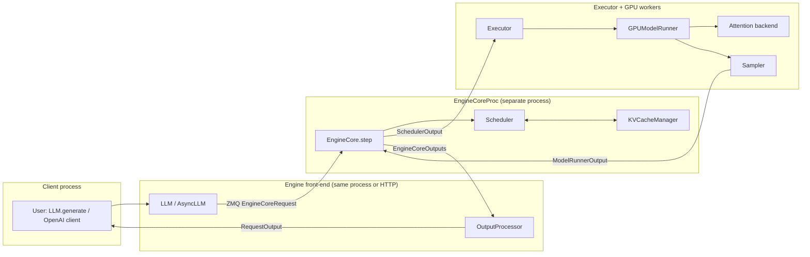
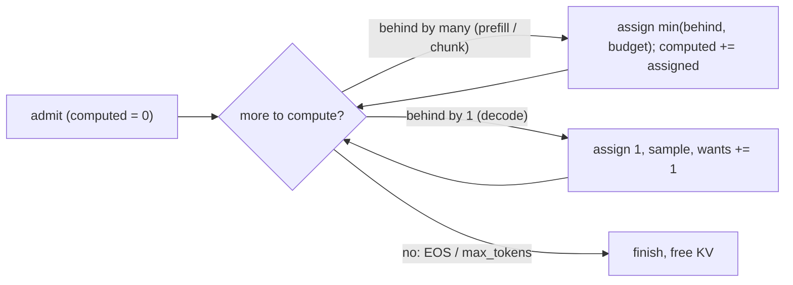
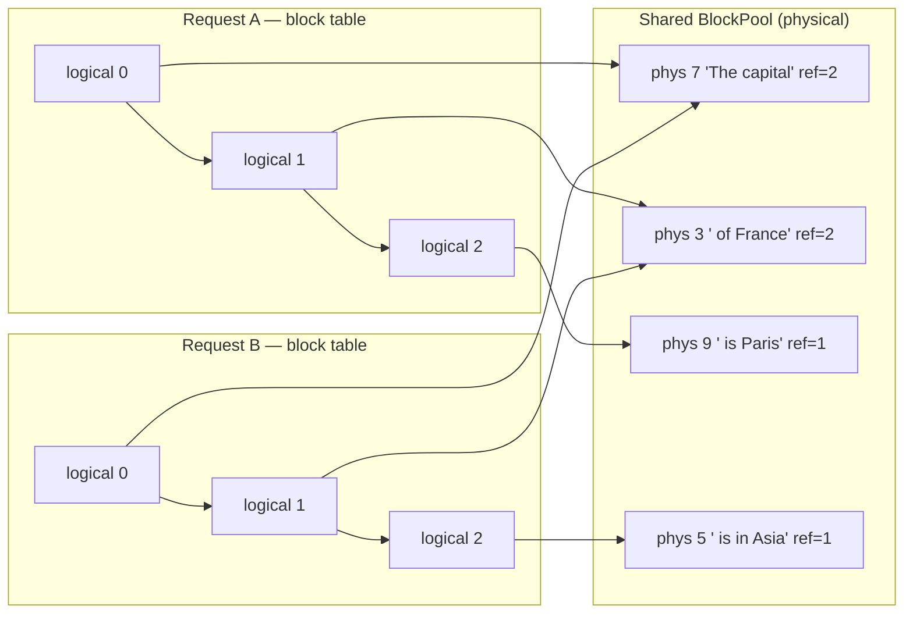
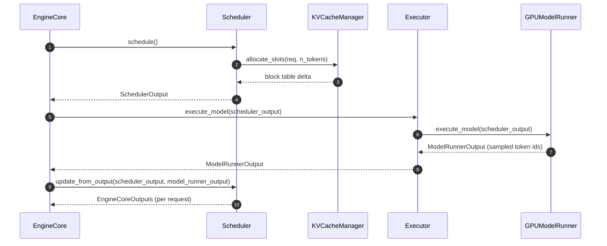
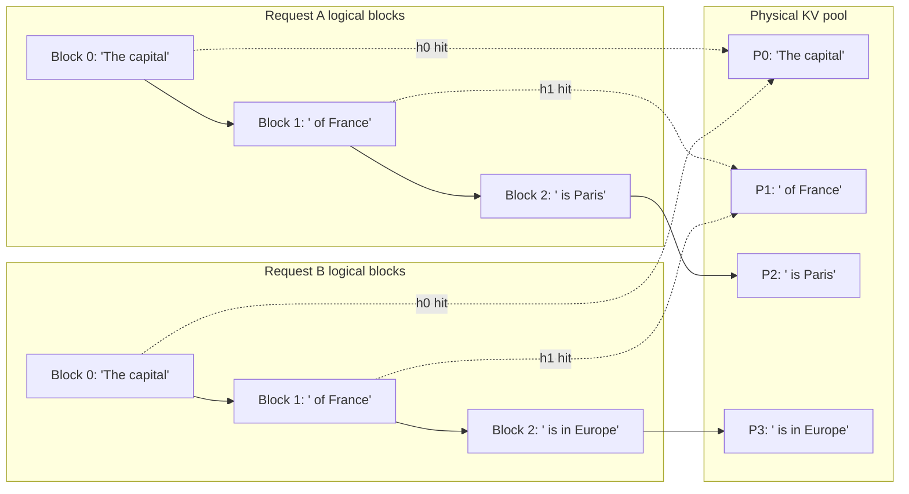
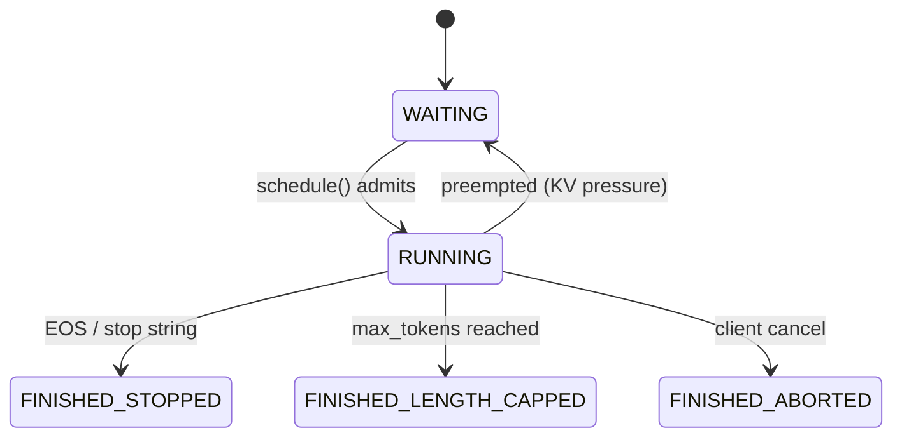
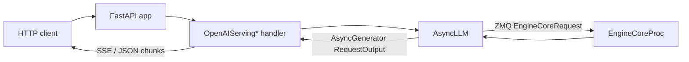

# vLLM Hacker's Guide

> **Scope:** a code-first tour of the **V1 engine** as it exists on
> `vllm-project/vllm` **v0.22.0** (released May 30, 2026). Inspired by the
> September 2025 blog post
> [*Inside vLLM: Anatomy of a High-Throughput LLM Inference System*](https://blog.vllm.ai/2025/09/05/anatomy-of-vllm.html),
> updated to the current code and paired with a `hacks/` directory of
> runnable scripts that exercise each subsystem in isolation. This is a
> *teaching* guide: each section gives the **background** (the problem and why
> it's hard), the **algorithm** (data structures, invariants, complexity), a
> **worked example**, and the **tradeoffs** — then points you at the real code.
>
> If you only want one sentence: every request enters via
> [`vllm/entrypoints/llm.py:66`](vllm/entrypoints/llm.py) (`class LLM`),
> is forwarded into the V1 engine, gets scheduled by
> [`vllm/v1/core/sched/scheduler.py:64`](vllm/v1/core/sched/scheduler.py)
> (`class Scheduler`), is executed by
> [`vllm/v1/worker/gpu_model_runner.py:415`](vllm/v1/worker/gpu_model_runner.py)
> (`class GPUModelRunner`), and streams back through
> [`vllm/v1/engine/output_processor.py:110`](vllm/v1/engine/output_processor.py)
> (`class OutputProcessor`). Everything else is detail.

---

## Table of contents

1. [How to read this guide](#1-how-to-read-this-guide)
2. [What's new in v0.22.0](#2-whats-new-in-v0220)
3. [30-second architecture](#3-30-second-architecture)
4. [Foundations: five mental models](#4-foundations-five-mental-models)
5. [`LLM.generate()` — the entry point](#5-llmgenerate--the-entry-point)
6. [Input processing & tokenization](#6-input-processing--tokenization)
7. [EngineCore: the step loop](#7-enginecore-the-step-loop)
8. [The Scheduler](#8-the-scheduler)
9. [Paged attention & the KV cache manager](#9-paged-attention--the-kv-cache-manager)
10. [KV cache sizing & memory profiling](#10-kv-cache-sizing--memory-profiling)
11. [Multi-tier KV cache offloading](#11-multi-tier-kv-cache-offloading)
12. [Continuous batching, in code](#12-continuous-batching-in-code)
13. [Attention backends](#13-attention-backends)
14. [Sampling](#14-sampling)
15. [Request lifecycle & output](#15-request-lifecycle--output)
16. [Model loading & the model registry](#16-model-loading--the-model-registry)
17. [Workers & executors](#17-workers--executors)
18. [Model Runner V2](#18-model-runner-v2)
19. [CUDA graphs & torch.compile](#19-cuda-graphs--torchcompile)
20. [Multi-GPU / distributed](#20-multi-gpu--distributed)
21. [Advanced features](#21-advanced-features)
22. [DeepSeek V4](#22-deepseek-v4)
23. [The serving layer](#23-the-serving-layer)
24. [Rust frontend](#24-rust-frontend)
25. [Where to go next](#25-where-to-go-next)
26. [Hands-on hacks](#26-hands-on-hacks)
27. [Contributing](#27-contributing)

---

## 1. How to read this guide

**Prerequisites.** A working PyTorch install, a CUDA-capable GPU helps
but is not required for most of the `hacks/` scripts, and the
contributor environment described in [`AGENTS.md`](AGENTS.md):

```bash
curl -LsSf https://astral.sh/uv/install.sh | sh
uv venv --python 3.12 && source .venv/bin/activate
VLLM_USE_PRECOMPILED=1 uv pip install -e . --torch-backend=auto
uv pip install -r requirements/lint.txt && pre-commit install
```

**Running example.** Throughout the guide we trace this five-line
program through the engine:

```python
from vllm import LLM, SamplingParams

llm = LLM(model="facebook/opt-125m")
outs = llm.generate(["The capital of France is"], SamplingParams(max_tokens=8))
print(outs[0].outputs[0].text)
```

**How each section is built.** Start with §4 (Foundations) — it sets up the
five ideas every other section leans on. After that, each subsystem section
follows the same shape: *the problem → how it works → a worked example → the
tradeoffs*, ending with a **▶ Try it** pointer to a script in `hacks/` that
exercises the component **without booting the whole engine** (no weights, no
CUDA in most cases).

**Conventions.** Code references use the form
`vllm/path/to/file.py:LINE` and link into the tree at the
**current** SHA on disk. Line numbers drift; treat them as hints and
search by the named symbol if a line moves. (The companion
[vLLM Explorer](https://phi9t.github.io/vllm/) re-grounds every reference
by symbol-grep, so its "Component Deep Dive" stays accurate even when
lines shift — and renders this guide as a page.)

---

## 2. What's new in v0.22.0

v0.22.0 (May 30, 2026) landed **459 commits from 230 contributors**. The
changes that matter most for a hacker reading the engine:

- **🐋 DeepSeek V4 matured into a dedicated package**
  ([`vllm/models/deepseek_v4/`](vllm/models/deepseek_v4/)): NVFP4 fused
  MoE, full + piecewise CUDA graphs, MTP speculative decoding on ROCm,
  more fused kernels, and ROCm parity. Registered as `DeepseekV4ForCausalLM`
  at [`vllm/model_executor/models/registry.py:101`](vllm/model_executor/models/registry.py).
  See §22.
- **🦀 Experimental Rust frontend moved in-tree** ([`rust/`](rust/)) — a
  Cargo workspace for the serving front-end / control plane. See §24.
- **🛠️ Model Runner V2** — a next-gen runner under the new
  [`vllm/v1/worker/gpu/model_runner.py`](vllm/v1/worker/gpu/model_runner.py)
  subpackage, with oracle backend selection (Qwen3). See §18.
- **⚡ Batch invariance** — a Cutlass FP8 path
  ([`vllm/model_executor/layers/batch_invariant.py`](vllm/model_executor/layers/batch_invariant.py))
  giving a reported ~28.9% end-to-end latency win, compile-mode support on
  SM80, and an NVFP4 Cutlass linear path. Bit-for-bit reproducible matmuls
  regardless of batch composition.
- **🧊 Multi-tier KV cache offloading**
  ([`vllm/v1/kv_offload/`](vllm/v1/kv_offload/)) — spill KV blocks from GPU
  HBM to host RAM to disk. See §11.
- **🟢 NVIDIA Blackwell:** FlashInfer MoE + FP4 GEMM for SM120/121;
  per-tensor FP8 CUTLASS on SM12.1. **🔴 AMD ROCm:** DeepSeek V4.
- **🆕 New architectures:** MiniCPM-V 4.6, InternS2 Preview, OpenVLA;
  custom-callable spec-decode proposers; broader tool-calling.

**Before you upgrade.** Pin churn around `nvidia-cutlass-dsl` (now
`==4.5.2` with the `[cu13]` extra on CUDA 13) and the NIXL connector
(`1.x`); the V1 default CUDA-graph mode is `FULL_AND_PIECEWISE` (§19).
Full notes: the
[v0.22.0 release](https://github.com/vllm-project/vllm/releases/tag/v0.22.0).

---

## 3. 30-second architecture



The boxes correspond to concrete files (v0.22.0 lines):

| Box | File | Symbol |
| --- | --- | --- |
| `LLM` / `AsyncLLM` | [`vllm/entrypoints/llm.py:66`](vllm/entrypoints/llm.py) / [`vllm/v1/engine/async_llm.py:70`](vllm/v1/engine/async_llm.py) | `class LLM` / `class AsyncLLM` |
| `EngineCoreProc` | [`vllm/v1/engine/core.py:835`](vllm/v1/engine/core.py) | `class EngineCoreProc` |
| `EngineCore.step` | [`vllm/v1/engine/core.py:428`](vllm/v1/engine/core.py) | `def step` |
| `Scheduler` | [`vllm/v1/core/sched/scheduler.py:64`](vllm/v1/core/sched/scheduler.py) | `class Scheduler` |
| `KVCacheManager` | [`vllm/v1/core/kv_cache_manager.py:110`](vllm/v1/core/kv_cache_manager.py) | `class KVCacheManager` |
| `Executor` | [`vllm/v1/executor/abstract.py:37`](vllm/v1/executor/abstract.py) | `class Executor` (ABC) |
| `GPUModelRunner` | [`vllm/v1/worker/gpu_model_runner.py:415`](vllm/v1/worker/gpu_model_runner.py) | `class GPUModelRunner` |
| `Sampler` | [`vllm/v1/sample/sampler.py:20`](vllm/v1/sample/sampler.py) | `class Sampler` |
| `OutputProcessor` | [`vllm/v1/engine/output_processor.py:110`](vllm/v1/engine/output_processor.py) | `class OutputProcessor` |

The split that matters: the **front-end** (tokenize, detokenize, HTTP) runs
in the client process; the **engine core** (schedule + KV + execute) runs in
its own process and the two talk over ZMQ. That boundary is why the same
engine serves both `LLM.generate()` and the OpenAI server, and it's where the
Rust frontend (§24) plugs in.

---

## 4. Foundations: five mental models

Five ideas explain almost every design decision in V1. Internalize these and
the rest of the guide is detail.

### 4.1 Continuous batching & the unified token model

**The problem.** The obvious way to batch inference is *request-level* (a.k.a.
static batching): gather N prompts, run them as a fixed batch, return when all
finish. Two things kill it. First, **head-of-line blocking** — a 5-token reply
is held hostage by a 500-token reply in the same batch, and the GPU keeps
re-running the finished sequence's padding. Second, **no mid-flight admission** —
a request that arrives at step 2 waits for the whole batch to drain. On a chat
workload (wildly varying output lengths) utilization craters.

**The fix: iteration-level scheduling.** vLLM (following Orca) re-decides the
batch *every step* at **token** granularity. The move that makes this clean —
read the NOTE at
[`vllm/v1/core/sched/scheduler.py:329`](vllm/v1/core/sched/scheduler.py) — is
that the scheduler has **no "prefill phase" and no "decode phase."** Each
`Request` carries just two integers:

- `num_computed_tokens` — tokens that already have KV in the cache; starts at 0
  ([`vllm/v1/request.py:145`](vllm/v1/request.py)).
- `num_tokens_with_spec` — tokens it *wants* computed:
  `len(prompt + output_so_far) + len(spec_draft)`
  ([`vllm/v1/request.py:243`](vllm/v1/request.py)).

**The invariant.** Every step, give each request enough tokens to make
`num_computed_tokens` **catch up** toward `num_tokens_with_spec`, bounded by a
single per-step **token budget** (the flat batch width, §8). The *size* of the
catch-up is the only difference between what we'd call prefill and decode:

| step | event | computed → wants | assigned | reads as |
|---|---|---|---|---|
| 1 | prompt of 20 admitted, budget 16 | 0 → 20 | 16 | prefill (chunked by budget) |
| 2 | finish prompt; model emits tok 21 | 16 → 20, then → 21 | 4 | prefill tail |
| 3 | generate | 20 → 21 | 1 | decode |
| 4 | generate | 21 → 22 | 1 | decode |

A fresh request is "behind" by its whole prompt (big catch-up = prefill); a
generating request is behind by one (catch-up of 1 = decode). One request's
whole life is just this loop:



**Why it matters (the payoff).** Three "features" are not features at all —
they're different counter values in the *same* loop:

- **Chunked prefill** = the budget caps step 1's catch-up, spreading a long
  prompt over several steps so it can't monopolize the batch.
- **Prefix caching** = `num_computed_tokens` jumps forward for free when a
  prefix's blocks are already resident (§9).
- **Speculative decoding** = `spec_token_ids` makes `num_tokens_with_spec` jump
  by *k*, so the target model verifies k+1 tokens in one step.

Because the scheduler never branches on "prefill vs decode," one flat batch
freely mixes a request finishing its prompt, another decoding its 200th token,
and a third just admitted — which is exactly what §12 packs into one tensor.

### 4.2 Paged memory (the KV cache is virtual memory)

**The problem, quantified.** A transformer must keep the keys/values of every
past token (the **KV cache**) to attend over them when generating the next.
The naive layout gives each request one *contiguous* buffer sized to
`max_model_len`. Two failure modes:

- **Internal fragmentation** — a 40-token chat in a 4096-token slab uses
  `40/4096 ≈ 1%`; the other **99% is reserved but idle**. You can't reclaim it
  because the request might still grow.
- **External fragmentation** — even with free memory, you can't admit a request
  unless a *single contiguous* max-length slab is free. Free space scattered in
  small holes is unusable.

The result: you fit a handful of concurrent sequences and the GPU starves.

**The fix is the OS virtual-memory trick.** Chop the cache into fixed-size
**blocks** (default `block_size = 16` tokens,
[`vllm/config/cache.py:47`](vllm/config/cache.py)), keep a shared **pool** of
physical blocks, and give each request a **block table** mapping its *logical*
blocks → *physical* blocks. The correspondence is exact:

| OS virtual memory | vLLM paged KV cache |
|---|---|
| page | block (16 tokens of K/V) |
| page table | block table (per request) |
| physical RAM | the shared `BlockPool` ([`block_pool.py:130`](vllm/v1/core/block_pool.py)) |
| free-frame list | doubly-linked `KVCacheBlock` queue ([`kv_cache_utils.py:116`](vllm/v1/core/kv_cache_utils.py)) |
| shared read-only page | shared prefix block (`ref_cnt > 1`) |
| page fault from disk | fault-back from an offload tier (§11) |

A request grows **one block at a time, on demand**, so a 40-token chat costs
`⌈40/16⌉ = 3` blocks — not 256. Physical order is irrelevant because attention
follows the block table. And because the table is just pointers, two requests
with the same prefix can point at the **same physical blocks** (bumping
`ref_cnt`); a block is evictable only when `ref_cnt == 0`:



**Consequences.** Near-zero internal waste, prefix sharing for free, and
graceful pressure handling (evict the coldest unreferenced block, not a whole
request). The same blocks-by-hash machinery powers prefix caching (§9) and
offloading (§11). §9 is the concrete mechanism — `allocate_slots`, the LRU, and
the hash chain that makes sharing safe.

### 4.3 Prefill vs decode are different *compute profiles*

The scheduler doesn't distinguish prefill and decode (§4.1), but the **hardware
does** — and which one you're doing decides whether you're limited by FLOPs or
by memory bandwidth.

**Arithmetic intensity & the roofline.** A kernel's *arithmetic intensity* is
FLOPs performed per byte moved from HBM. A GPU has a fixed compute:bandwidth
ratio; plot achievable throughput against intensity and you get a **roofline**:
below the "ridge" intensity you're **memory-bound** (bandwidth caps you), above
it you're **compute-bound** (FLOPs cap you).

```
 throughput
   (FLOP/s)
   peak ┤             ________________  ← compute-bound roof (peak FLOP/s)
        │            /
        │           /  ridge point
        │          /
        │        / ← memory-bound roof (slope = HBM bandwidth)
        │      /
        │    /  ● decode (low intensity: ~2 FLOP/byte, reuses each weight once)
        │  /
        │/_____________________●__________  prefill (high intensity: big GEMMs)
        └──────────────────────────────────  arithmetic intensity (FLOP/byte)
```

- **Prefill** multiplies *n* prompt tokens through every weight matrix at once →
  large GEMMs (plus O(n²) attention) → each weight byte is reused across many
  tokens → high intensity → **compute-bound**.
- **Decode** produces *one* token per request, so each weight is used for a
  single multiply before the next weight is needed → intensity ≈ 2 FLOP/byte →
  you spend the step **streaming the whole model (weights + KV) through the
  ALUs** → **memory-bandwidth-bound**.

**The decode latency floor (batch 1).** Because decode must read essentially all
weights to emit one token, its per-token time can't beat
`weights_bytes / HBM_bandwidth`. For a **7 B** model in bf16 (≈ 14 GB):

| GPU | HBM bandwidth | floor = 14 GB ÷ BW |
|---|---|---|
| A100-80GB | ~2.0 TB/s | **~7.0 ms/token** |
| H100-SXM | ~3.35 TB/s | **~4.2 ms/token** |
| B200 | ~8 TB/s | **~1.75 ms/token** |

(KV reads add to this and grow with context; weights dominate at short context.)
The formula is hardware-agnostic: faster HBM → proportionally faster decode.

**Why batching is the decode lever.** Read the weights **once**, reuse them for
N requests' tokens in the same step → ~N× throughput for nearly the same
latency, until you saturate compute or KV bandwidth. That's the whole reason
continuous batching (§4.1) exists; prefill, already compute-bound, gains far
less from batching.

| | prefill | decode |
|---|---|---|
| tokens/step (per req) | many (the prompt) | 1 |
| bound by | FLOPs (compute) | HBM bandwidth (weights + KV) |
| batching helps? | little (already saturated) | **enormously** (amortize weight read) |
| CUDA-graphable? | piecewise (variable shape) | full graph (fixed shape) |

**The bridge to code.** Even though the scheduler is unified, the runner and
attention kernel still recognize the decode shape: a uniform decode batch is
`max_query_len == 1` with `cu_query_lens`, which gets a captured CUDA-graph fast
path ([`vllm/v1/attention/backends/flash_attn.py:281`](vllm/v1/attention/backends/flash_attn.py),
§19), while prefill runs eager/piecewise. **Consequences:** long prompts starve
decode → chunked prefill (§8); shrinking the bytes decode must read —
quantization, GQA, MLA — directly cuts latency (§10, §22).

### 4.4 The memory hierarchy & the roofline

A GPU has fast compute and (relatively) slow memory. Whether a kernel is
compute- or memory-bound is its *arithmetic intensity* (FLOPs per byte) versus
the GPU's ratio — the **roofline**. Decode is far left of the ridge: you read
~all the weights to compute one token, so **latency ≈ (weights + KV) ÷ HBM
bandwidth**. Three consequences you'll see everywhere: quantization shrinks the
bytes you must read (faster decode), KV compression (GQA/MLA, §10) shrinks the
KV you must read, and CUDA graphs (§19) remove per-kernel launch overhead that
dominates when each kernel is tiny.

### 4.5 Throughput vs latency is the central tension

Every knob trades these two. Bigger batches and bigger prefill chunks raise
throughput but hurt per-request latency; preemption (§8) protects throughput
under memory pressure at the cost of a victim's latency; CUDA graphs and the
Rust frontend cut latency; offloading (§11) buys effective capacity at the cost
of fault-back latency. The **scheduler** is the component that arbitrates this
tension every single step — which is why it's the most important file in V1.

---

## 5. `LLM.generate()` — the entry point

The user-facing `LLM` wraps an inner `LLMEngine`, which in V1 is a thin
adapter that talks to an `EngineCore` (either in-process or over ZMQ).

- [`vllm/entrypoints/llm.py:66`](vllm/entrypoints/llm.py) — `class LLM`.
- [`vllm/entrypoints/llm.py:422`](vllm/entrypoints/llm.py) — `def generate(...)`. It:
  1. Validates prompts / sampling params.
  2. Calls `_validate_and_add_requests` which tokenizes each prompt and
     calls `self.llm_engine.add_request(...)`.
  3. Pumps `_run_engine()` until every added request finishes, then
     returns a list of `RequestOutput` ordered by submission.
- [`vllm/v1/engine/llm_engine.py:47`](vllm/v1/engine/llm_engine.py) —
  `class LLMEngine`, the V1 sync wrapper.
- [`vllm/v1/engine/async_llm.py:70`](vllm/v1/engine/async_llm.py) —
  `class AsyncLLM`, the async sibling used by the OpenAI server. Its
  `add_request` tokenizes and forwards an `EngineCoreRequest`; its
  `generate` is an `AsyncGenerator[RequestOutput, None]` that yields each
  incremental output until the request is `FINISHED_*`.

**Offline vs. online.** Both `LLMEngine` and `AsyncLLM` ultimately push
`EngineCoreRequest` objects over the same boundary. The difference is
back-pressure and threading: `LLMEngine` drives the loop synchronously (call
`generate`, block, get a list back), `AsyncLLM` yields control to asyncio
between steps so an HTTP server can interleave hundreds of requests. **Same
engine, two front-ends** — which is the whole point of the process split (§3).

▶ Try it: [`hacks/01_llm_smoke.py`](hacks/01_llm_smoke.py) (loads a real
model — gated by `VLLM_HACK_RUN_MODEL=1`).

---

## 6. Input processing & tokenization

Before the scheduler ever sees a request, the front-end turns a prompt
into an `EngineCoreRequest`. The reason this is its own stage: prompts arrive
in many shapes (raw text, pre-tokenized ids, chat turns, images/audio), and the
engine wants exactly one normalized thing — a list of token ids (plus
multimodal features) — so the hot loop never branches on prompt type.

```
prompt (str / chat / tokens / multimodal)
   │  tokenizer  (vllm/transformers_utils/tokenizer.py)
   ▼
token_ids
   │  InputPreprocessor  (vllm/inputs/preprocess.py:48)   ← prompt-type
   ▼                                                         normalization, MM
ProcessorInputs
   │  InputProcessor     (vllm/v1/engine/input_processor.py:36)
   ▼
EngineCoreRequest        (vllm/v1/engine/__init__.py:80)
```

- [`vllm/inputs/preprocess.py:48`](vllm/inputs/preprocess.py) —
  `class InputPreprocessor`. Normalizes the many prompt shapes into a single
  internal representation and runs the tokenizer.
- [`vllm/v1/engine/input_processor.py:36`](vllm/v1/engine/input_processor.py)
  — `class InputProcessor`. The V1 front-end stage that assigns the request
  id, attaches sampling/pooling params and LoRA, and emits the
  `EngineCoreRequest` that crosses into the engine.
- [`vllm/v1/engine/__init__.py:80`](vllm/v1/engine/__init__.py) —
  `class EngineCoreRequest`. The `msgspec.Struct` the scheduler reads:
  `request_id`, `prompt_token_ids`, `mm_features`, `sampling_params`,
  `arrival_time`, `lora_request`, `cache_salt`, …

**Why a `msgspec.Struct`?** This object crosses the ZMQ process boundary every
request; `msgspec` gives near-zero-copy, schema-checked (de)serialization, far
cheaper than pickling. The same byte-level tokenization is what the companion
[Explorer's Data mode](https://phi9t.github.io/vllm/) visualizes piece by piece.

▶ Try it: [`hacks/14_input_processor.py`](hacks/14_input_processor.py) —
prompt → token ids → `EngineCoreRequest` shape, no model.

---

## 7. EngineCore: the step loop

`EngineCore` ([`vllm/v1/engine/core.py:94`](vllm/v1/engine/core.py))
owns the scheduler, the KV cache manager, and the executor. It is the
*synchronous heart*: everything it does is one `step()` at a time, and the
whole system's throughput is "useful tokens per step × steps per second."

- `add_request` ([line 337](vllm/v1/engine/core.py)) — validates inputs,
  builds a `Request`, and pushes it into the scheduler's waiting queue.
- `step` ([line 428](vllm/v1/engine/core.py)) — one tick of the engine.
  Always three stages, and the contract between them is two plain dataclasses
  (`SchedulerOutput` in, `ModelRunnerOutput` out):



The three stages are **decide (schedule) → execute → account (update)**. Keeping
them separate is what lets the executor be swapped (uniproc, multiproc, Ray)
without the scheduler knowing, and what lets a stub stand in for the model — the
basis of the zero-CUDA capstone hack.

`EngineCoreProc` ([line 835](vllm/v1/engine/core.py)) is the
multi-process variant; its `run_busy_loop`
([line 1193](vllm/v1/engine/core.py)) sits on a ZMQ socket, decodes
client requests, calls `step()`, and ships `EngineCoreOutputs` back. In
single-process / "uniproc" mode `LLMEngine` drives `step()` directly.

▶ Try it: [`hacks/12_engine_step.py`](hacks/12_engine_step.py) — drives
one full engine step end-to-end with a stub model, **zero CUDA**.

---

## 8. The Scheduler

The scheduler is the single most important file in V1: it decides, every step,
*which requests run and how many tokens each gets*, under a fixed compute and
memory budget. Get it wrong and you either starve requests or OOM the KV pool.

- [`vllm/v1/core/sched/scheduler.py:64`](vllm/v1/core/sched/scheduler.py)
  — `class Scheduler(SchedulerInterface)`.
- [`vllm/v1/core/sched/output.py`](vllm/v1/core/sched/output.py) —
  `SchedulerOutput` (the contract with the executor).

### The problem

You have a single **token budget** per step (`max_num_scheduled_tokens` — the
biggest flat batch the GPU should run) and a finite **KV pool**. Requests want
wildly different amounts of compute (a fresh 2000-token prompt vs. a request
that needs one more token). You must pack the step to keep the GPU busy
(throughput) without letting long prefills monopolize it (latency) or running
out of KV blocks mid-step.

### The algorithm (one loop, no phases)

`schedule()` ([line 329](vllm/v1/core/sched/scheduler.py)) — recall §4.1: each
request just needs `num_computed_tokens` to catch up to `num_tokens_with_spec`.

1. `token_budget = max_num_scheduled_tokens`.
2. **Running first.** Walk `self.running`; for each request,
   `num_new_tokens = num_tokens_with_spec + num_output_placeholders −
   num_computed_tokens`, then clamp by `long_prefill_token_threshold` (caps any
   single request's slice so one long prefill can't eat the batch), by the
   remaining `token_budget`, and by `max_model_len`. Ask the KV manager to
   `allocate_slots` for those tokens.
3. **Preempt under pressure.** If allocation fails (pool full), pick a victim
   with `max(self.running, key=…)` ([line 457](vllm/v1/core/sched/scheduler.py)) —
   effectively the most-recently-admitted / lowest-priority request — evict it
   back to `WAITING`, free its KV, and **restore its tokens to the budget**.
   Retry. (This is graceful degradation, not an OOM.)
4. **Then admit waiting.** With leftover budget and free blocks, promote
   `WAITING` requests, checking the prefix cache (§9) first so a shared prefix
   costs zero new compute.
5. **Emit `SchedulerOutput`** — flat per-request token counts, block tables,
   and slot mappings the worker turns straight into tensors (§12).

`update_from_output()` ([line 1283](vllm/v1/core/sched/scheduler.py)) is the
feedback half: append each sampled token, advance `num_computed_tokens`, check
stop conditions (EOS, `max_tokens`, stop strings), and `free` KV for finished
requests.

### Worked example

`token_budget = 16`, three requests: **A** (prompt 20, wants 2 out), **B**
(prompt 8, wants 3), **C** (prompt 12, wants 1). With `long_prefill_threshold`
unset:

| step | running (computed/total) | assigned this step | budget used | notes |
|---|---|---|---|---|
| 1 | — | A: 16 (chunk of its 20-tok prefill) | 16/16 | A's prefill is chunked; B, C wait |
| 2 | A 16/20 | A: 4 (finish prefill), B: 8 (prefill), C: 4 (chunk) | 16/16 | one flat batch mixes A-decode-soon, B-prefill, C-prefill |
| 3 | A 20/20, B 8/8, C 12/16→… | A: 1, B: 1, C: 8… | 16/16 | A & B now decode (1 tok each); C still prefilling |

Notice steps 2–3 mix prefill and decode tokens in **one** batch — that's §4.1
and §12 in action. If the pool filled at step 2, C (newest) would be preempted
and its 4 tokens returned to the budget.

### Tradeoffs & failure modes

- `long_prefill_token_threshold` trades prefill latency for decode fairness.
- Preemption thrashing: under sustained KV pressure a victim can be evicted and
  re-admitted repeatedly; prefix caching softens this (its prefill is cheap to
  redo). 
- The hacks' `MiniScheduler` teaches a *simplified* two-pass (decode-then-prefill)
  model; the real engine is the single catch-up loop above.

▶ Try it:
- [`hacks/05_scheduler_step.py`](hacks/05_scheduler_step.py) — a miniature
  scheduler with three synthetic requests.
- [`hacks/06_chunked_prefill.py`](hacks/06_chunked_prefill.py) — long
  prompt, small budget, watch the prompt get sliced.

---

## 9. Paged attention & the KV cache manager

### The problem

Per §4.2: a contiguous per-request KV buffer sized to the max length wastes
most of its space (a 30-token chat in a 4096 slab) and blocks admission. We want
to allocate KV in small pieces, on demand, and share identical prefixes.

### The data structures

- **Block**: KV storage for `block_size` (default 16) tokens of one layer-group.
- **Block table**: per request, a list mapping logical block i → a physical
  block id. Attention reads KV by following this table — random physical order
  is fine.
- **`BlockPool`** ([`vllm/v1/core/block_pool.py:130`](vllm/v1/core/block_pool.py))
  — the free list + an LRU of *unreferenced* cached blocks, plus a
  `cached_block_hash_to_block` map for prefix lookups. Every physical block has
  a `ref_cnt`; a block is evictable only when `ref_cnt == 0`.
- **`KVCacheManager`** ([`vllm/v1/core/kv_cache_manager.py:110`](vllm/v1/core/kv_cache_manager.py)):
  `allocate_slots(request, num_tokens)` ([line 236](vllm/v1/core/kv_cache_manager.py))
  returns the *delta* of new blocks (raising if the pool is full → triggers
  scheduler preemption), and `free(request)` ([line 429](vllm/v1/core/kv_cache_manager.py))
  drops ref-counts.

### Prefix sharing via a hash *chain*

The trick that makes prefix caching correct:
`get_request_block_hasher` ([`vllm/v1/core/kv_cache_utils.py:637`](vllm/v1/core/kv_cache_utils.py))
hashes **only full blocks**, and **each block's hash folds in the previous
block's hash**: `h_i = hash(h_{i-1}, tokens_i, extra_keys)`. So two requests with
the same prefix produce the *same chain* of hashes up to the point they diverge —
and `BlockPool.get_cached_block` returns the already-resident physical blocks
(bumping `ref_cnt` via `touch`). The `extra_keys` (multimodal/LoRA) and a
per-cache-group id (`BlockHashWithGroupId`) keep different content from colliding.



### Worked example

`block_size = 16`. Request A = "The capital of France is Paris" (say 34 tokens).
Blocks: `h0 = hash(None, tok[0:16])`, `h1 = hash(h0, tok[16:32])`; the trailing
2 tokens are a *partial* block → not hashed yet. Request B shares the first 32
tokens → recomputes `h0, h1`, both hit in `cached_block_hash_to_block`, so B
allocates **0** new blocks for its prefix and `ref_cnt` of P0,P1 goes 1→2.
B's prefill therefore skips ~32 tokens of compute. When A frees, P0/P1 stay
(ref_cnt still 1 from B); only when both free does the LRU make them evictable.

### Tradeoffs & failure modes

- Block size: bigger blocks = fewer block-table entries and bigger shared
  prefixes, but coarser allocation (more waste in the last partial block).
- Eviction is LRU over *unreferenced* blocks only — a hot shared prefix is never
  evicted, which is exactly what you want.

▶ Try it:
- [`hacks/03_kv_cache_manager.py`](hacks/03_kv_cache_manager.py) — allocate /
  share / free blocks directly on a `BlockPool`.
- [`hacks/04_prefix_cache_hashing.py`](hacks/04_prefix_cache_hashing.py) —
  watch two prompts hash to identical prefix blocks.

---

## 10. KV cache sizing & memory profiling

### The problem

How many tokens of KV can you actually hold, and where does
`gpu_memory_utilization` go? You can't know the activation peak analytically (it
depends on batch shape and the model), so vLLM **measures** it at startup rather
than guessing.

### The algorithm

1. **Profile.** The worker runs a dummy forward at the max batch shape and reads
   peak memory:
   [`vllm/v1/worker/gpu_worker.py:354`](vllm/v1/worker/gpu_worker.py)
   `determine_available_memory`. Free-for-KV ≈
   `total · gpu_memory_utilization − weights − peak_activations − cudagraphs`.
2. **Spec.** Each attention layer declares a `KVCacheSpec`
   ([`vllm/v1/kv_cache_interface.py:82`](vllm/v1/kv_cache_interface.py);
   `FullAttentionSpec` at [line 175](vllm/v1/kv_cache_interface.py)) whose
   `page_size_bytes` is the cost of one block.
3. **Blocks.** `get_kv_cache_configs`
   ([`vllm/v1/core/kv_cache_utils.py:1922`](vllm/v1/core/kv_cache_utils.py))
   divides free bytes by the per-block cost → `num_gpu_blocks`, reconciling
   layers that share a pool.

The arithmetic for a standard attention layer:

```
bytes_per_token = 2 (K and V) · num_layers · num_kv_heads · head_dim · dtype_bytes
block_bytes     = bytes_per_token · block_size            # block_size default 16 (vllm/config/cache.py:47)
num_gpu_blocks  = floor(free_kv_bytes / block_bytes)
kv_tokens       = num_gpu_blocks · block_size
```

### Worked example (from hack 15)

An 80 GiB GPU at `util=0.9` (≈72 GiB for KV after a rough weights subtraction),
`block_size=16`, bf16:

- **Qwen3-8B (GQA, 36 layers, 8 KV heads, head_dim 128):**
  `bytes/token = 2·36·8·128·2 = 147,456`; `block_bytes ≈ 2.36 MB`;
  `num_gpu_blocks ≈ 32,768` → **~524K tokens** of KV.
- **DeepSeek (MLA, 61 layers, latent 512+64):** stores **one** latent per token
  per layer instead of per-head K/V → far fewer bytes/token → many more tokens
  in the same VRAM. This is the headline reason MLA models serve long contexts.

### Tradeoffs & failure modes

- Set `util` too high and the profiling headroom is wrong → OOM mid-serving.
- GQA shrinks `num_kv_heads`; MLA replaces per-head K/V with a latent (§22);
  quantizing the KV cache halves `dtype_bytes`. All three buy more `kv_tokens`.

▶ Try it: [`hacks/15_kv_cache_sizing.py`](hacks/15_kv_cache_sizing.py) —
the calculator above for several real configs, no GPU.

---

## 11. Multi-tier KV cache offloading

New in v0.22.0: when the GPU pool is full, KV blocks can be **spilled to a
slower tier** instead of evicted, then faulted back on a prefix hit.

### The manager contract

A block lives in some tier, keyed by an `OffloadKey` (the same block hash
from §9 + a group id). The scheduler-side contract is
[`vllm/v1/kv_offload/base.py:110`](vllm/v1/kv_offload/base.py) —
`class OffloadingManager(ABC)`:

- `lookup(key)` → is this block offloaded and ready? (`None` = "retry
  later", which makes the scheduler delay the request).
- `prepare_load(keys)` → a `LoadStoreSpec` the worker uses to locate and
  copy the data in; pins the blocks against eviction until `complete_load`.
- `prepare_store(keys)` / `touch(keys)` (LRU) / `complete_load(keys)`.

The actual copies run in the
[`worker/worker.py`](vllm/v1/kv_offload/worker/worker.py) off the critical
path; an `OffloadingSpec`
([`base.py:331`](vllm/v1/kv_offload/base.py), built via
[`factory.py:17`](vllm/v1/kv_offload/factory.py)) wires a manager to a
backend.

### Tiering: a CPU "primary" gateway

The multi-tier orchestrator
([`vllm/v1/kv_offload/tiering/manager.py`](vllm/v1/kv_offload/tiering/manager.py)
`TieringOffloadingManager`) follows three rules that answer *where the
latency cliff is*:

1. **CPU primary tier is the gateway.** Only the CPU tier (a pinned
   `SharedOffloadRegion` mmap with direct GPU access) can DMA to/from HBM.
2. **Secondary tiers cascade.** A store fans out from CPU to *all* secondary
   tiers (storage, network); secondary tiers never touch GPU memory.
3. **Staged promotion.** A secondary-tier hit must be promoted **secondary →
   CPU primary → GPU**. That extra hop is the cliff: a CPU-primary hit is a
   PCIe copy (tens of µs); a disk/network hit pays the storage round-trip
   *plus* the promotion copy. So offloading wins only when the
   recomputation it avoids costs more than the fault-back path.

Knobs live in [`vllm/config/offload.py`](vllm/config/offload.py)
(`OffloadConfig.offload_backend`, `uva.cpu_offload_gb`, and a `prefetch`
group with `offload_group_size` / `offload_prefetch_step` to hide latency).

This reuses the same `BlockHash` prefix machinery as §9 — an offloaded block
is keyed by its hash, so a later request with a shared prefix faults it back
instead of recomputing. Cross-tier KV transfer *between engines*
(disaggregated prefill) is the related `kv_transfer` connector family (§20).

▶ Try it: revisit [`hacks/03_kv_cache_manager.py`](hacks/03_kv_cache_manager.py)
— the block-hash + ref-count mechanics offloading is built on.

---

## 12. Continuous batching, in code

### The problem

§4.1 says we batch at the token level and mix prefill + decode. But GPU kernels
want *tensors*, not a list of variable-length requests. How do you feed one
attention kernel a batch where request A contributes 8 prefill tokens, B
contributes 1 decode token, and C contributes 4?

### The layout

V1 **flattens the whole step into a single 1-D token sequence** and hands the
attention kernel a few index tensors (built in
[`vllm/v1/worker/gpu_input_batch.py`](vllm/v1/worker/gpu_input_batch.py)):

- `token_ids` — all scheduled tokens concatenated, no padding.
- `query_start_loc` — prefix-sum of per-request query lengths, so request *i*'s
  tokens are `token_ids[qsl[i] : qsl[i+1]]`.
- `seq_lens` — each request's *total* length (context + this step's tokens), so
  attention knows how far back to look.
- `slot_mapping` — for each query token, the flat KV slot
  (`block_id · block_size + offset`) to write its K/V into.
- block tables packed as a 2-D `(num_reqs, max_blocks)` tensor.

### Worked example (from hack 16)

A=20 prefill tokens (ctx 0), B=1 decode token (ctx 33), C=6 prefill (ctx 0):

```
token_ids        : 27 tokens, concatenated (20 + 1 + 6)
query_start_loc  : [0, 20, 21, 27]      → A=[0:20], B=[20:21], C=[21:27]
seq_lens         : [20, 34, 6]          → B attends over its full 34-token history
slot_mapping     : 27 entries, one KV slot per query token
```

There is **no separate prefill model**: the block table + `slot_mapping` let one
kernel serve A's prefill, B's decode, and C's prefill in the same launch.

### Tradeoffs

No padding means no wasted FLOPs, but the index bookkeeping is fiddly (and is
exactly what an attention backend must consume — §13). Read why this is correct
in [`docs/design/paged_attention.md`](docs/design/paged_attention.md).

▶ Try it: [`hacks/16_batch_packing.py`](hacks/16_batch_packing.py) —
build `query_start_loc` / `seq_lens` / `slot_mapping` from a synthetic
mixed batch, no CUDA.

---

## 13. Attention backends

### The problem

Attention is the one kernel that must understand the paged layout (§12), and the
"best" implementation depends on hardware (NVIDIA vs AMD vs CPU), dtype, head
size, and features (MLA, mamba). vLLM hides this behind a registry so the rest of
the engine is backend-agnostic.

### How selection works

- [`vllm/v1/attention/backend.py`](vllm/v1/attention/backend.py) —
  `AttentionBackend` (the registry surface) and `AttentionImpl` (the kernel base
  class every backend implements: take the flat tokens + block table + metadata,
  return the attention output).
- [`vllm/v1/attention/selector.py:52`](vllm/v1/attention/selector.py) —
  `get_attn_backend(...)` reads `VLLM_ATTENTION_BACKEND`, dtype, device, and head
  size, then picks:

| Backend file | Use case |
| --- | --- |
| [`backends/flash_attn.py`](vllm/v1/attention/backends/flash_attn.py) | NVIDIA, generic |
| [`backends/flashinfer.py`](vllm/v1/attention/backends/flashinfer.py) | NVIDIA, lower decode latency; MoE + FP4 GEMM on Blackwell |
| [`backends/triton_attn.py`](vllm/v1/attention/backends/triton_attn.py) | Triton kernels, broader hw |
| [`backends/flex_attention.py`](vllm/v1/attention/backends/flex_attention.py) | PyTorch 2.5+ FlexAttention |
| [`backends/rocm_aiter_fa.py`](vllm/v1/attention/backends/rocm_aiter_fa.py), [`rocm_attn.py`](vllm/v1/attention/backends/rocm_attn.py) | AMD ROCm |
| [`backends/cpu_attn.py`](vllm/v1/attention/backends/cpu_attn.py) | CPU fallback |
| [`backends/mla/`](vllm/v1/attention/backends/mla/) | Multi-head Latent Attention (DeepSeek) |

### Determinism: batch invariance

A subtle gotcha: floating-point reductions aren't associative, so the *same*
prompt can produce *different* logits depending on how requests batched together
that step. v0.22.0 adds a **batch-invariant** path
([`vllm/model_executor/layers/batch_invariant.py`](vllm/model_executor/layers/batch_invariant.py))
that routes matmuls through reduction-order-stable Cutlass FP8 kernels for
bit-exact, batch-composition-independent results — important for evals and
debugging. Cross-link: [`docs/design/attention_backends.md`](docs/design/attention_backends.md).

▶ Try it: [`hacks/09_attention_backend_select.py`](hacks/09_attention_backend_select.py)
— print the backend chosen for various `(head_size, dtype, device)` tuples.

---

## 14. Sampling

### The problem

The model emits raw **logits** (one score per vocab token). Turning those into a
chosen token id — honoring temperature, top-k/top-p, penalties, banned words,
and grammar masks — is a fixed pipeline of *logit transforms* followed by a draw.

### The pipeline

[`vllm/v1/sample/sampler.py:20`](vllm/v1/sample/sampler.py) `class Sampler`;
`forward()` does, in order:

1. **Snapshot raw logprobs** *before* any modification (so reported logprobs
   reflect the model, not the sampling knobs — a deliberate change from V0).
2. Cast logits to **float32** (stable softmax).
3. **`apply_logits_processors`** — the chain in
   [`vllm/v1/sample/logits_processor/`](vllm/v1/sample/logits_processor/):
   penalties ([`ops/penalties.py`](vllm/v1/sample/ops/penalties.py)), bad-words
   masks ([`ops/bad_words.py`](vllm/v1/sample/ops/bad_words.py)), structured-output
   grammar masks (§21), and any user processor — all just add/subtract from
   logits or set them to `-inf`.
4. **`sample()`** — temperature scale, then top-k / top-p truncation
   ([`ops/topk_topp_sampler.py`](vllm/v1/sample/ops/topk_topp_sampler.py)), then
   **argmax** (temperature 0 = greedy) or **multinomial** draw.
5. Gather logprobs/ranks if requested
   ([`ops/logprobs.py`](vllm/v1/sample/ops/logprobs.py)).

### Worked example

Logits `[2.0, 1.0, 0.5]` over tokens `{Paris, London, Berlin}`:

- **temperature 0** → argmax → "Paris", deterministic.
- **temperature 1, top-p 0.9** → softmax ≈ `[0.59, 0.22, 0.13]`(+tail); top-p
  keeps the smallest set summing ≥0.9 (here Paris+London), renormalizes, draws.
- a **bad-words** mask on "Paris" sets its logit to `-inf` → it can never be
  drawn, and the mass shifts to London/Berlin.

For speculative decoding there's a parallel
[`rejection_sampler.py`](vllm/v1/sample/rejection_sampler.py) that accepts/rejects
a draft model's proposed tokens while preserving the target distribution.

▶ Try it:
- [`hacks/07_sampler.py`](hacks/07_sampler.py) — hand-crafted logits
  through every knob.
- [`hacks/08_logits_processor.py`](hacks/08_logits_processor.py) — a
  20-line custom processor that bans one token.

---

## 15. Request lifecycle & output

A `Request` ([`vllm/v1/request.py:59`](vllm/v1/request.py)) is the engine's
unit of state: tokens so far, sampling params, multimodal inputs,
structured-output state, KV block table, arrival time, and current
`RequestStatus` ([line 315](vllm/v1/request.py)). It moves through the state
machine the scheduler drives (admit → run → preempt/finish):



On the way *out*,
[`vllm/v1/engine/output_processor.py:110`](vllm/v1/engine/output_processor.py)
— `class OutputProcessor` — owns one `RequestOutputCollector` per active request
and does the work the engine core shouldn't: **detokenize** new ids (handling
partial-UTF-8 boundaries — a multi-byte char split across two steps must not emit
mojibake), stitch streaming chunks for the OpenAI API, and decide when a request
is done *from the client's perspective* even if the engine ran an extra step.
This runs in the front-end process, off the hot loop.

▶ Try it:
- [`hacks/02_request_lifecycle.py`](hacks/02_request_lifecycle.py) —
  walk a `Request` through the `RequestStatus` state machine.
- [`hacks/10_output_processor.py`](hacks/10_output_processor.py) —
  drive `OutputProcessor` with synthetic engine outputs.

---

## 16. Model loading & the model registry

How does `LLM(model="…")` become an `nn.Module` with weights? Three steps,
all before the first `step()`:

1. **Resolve the class.** The HF config's `architectures[0]` string (e.g.
   `"Qwen3ForCausalLM"`, `"DeepseekV4ForCausalLM"`) is looked up in the
   registry:
   [`vllm/model_executor/models/registry.py:1319`](vllm/model_executor/models/registry.py)
   — `ModelRegistry` (an instance of `class _ModelRegistry` at
   [line 932](vllm/model_executor/models/registry.py)). It maps the string
   to a `(module, class)` pair, e.g.
   `"DeepseekV4ForCausalLM": ("vllm.models.deepseek_v4", "DeepseekV4ForCausalLM")`
   ([line 101](vllm/model_executor/models/registry.py)).
   `inspect_model_cls` ([line 764](vllm/model_executor/models/registry.py))
   probes capabilities (multimodal, pooling, …) without importing CUDA.
2. **Build + load.** `get_model(...)`
   ([`vllm/model_executor/model_loader/__init__.py:128`](vllm/model_executor/model_loader/__init__.py))
   picks a loader via `get_model_loader` ([line 120](vllm/model_executor/model_loader/__init__.py)),
   instantiates the module, and calls `load_weights`
   ([`base_loader.py:37`](vllm/model_executor/model_loader/base_loader.py)).
   Loader variants (safetensors, bitsandbytes, GGUF, …) all implement the
   `BaseModelLoader` ABC ([line 25](vllm/model_executor/model_loader/base_loader.py)).
3. **Place.** Weights are sharded across TP/PP ranks as they load; the
   module's own `load_weights` maps checkpoint tensor names → vLLM parameters
   (and fuses, e.g., separate q/k/v checkpoints into one `qkv_proj`).

This is the *construction* side of what the companion
[Architecture explorer](https://phi9t.github.io/vllm/) *renders* — the
per-layer blocks it draws are exactly the modules instantiated here.

▶ Try it: [`hacks/17_model_registry.py`](hacks/17_model_registry.py) —
inspect the registry / `get_model` API and compute a model's param &
KV-cache footprint from its config (GQA vs MLA, dense vs MoE).

---

## 17. Workers & executors

The **executor** owns one or more **workers**, each of which owns
one `GPUModelRunner`. The runner is what holds the actual `nn.Module`
and the CUDA graphs. The layering exists so the scheduler can stay
single-threaded and synchronous (§7) while execution fans out to N GPUs.

- [`vllm/v1/worker/gpu_model_runner.py:415`](vllm/v1/worker/gpu_model_runner.py)
  — `class GPUModelRunner`.
- [`vllm/v1/worker/gpu_model_runner.py:3955`](vllm/v1/worker/gpu_model_runner.py)
  — `def execute_model(scheduler_output)`. Steps it performs:
  1. Build input tensors from `SchedulerOutput` (via
     [`gpu_input_batch.py`](vllm/v1/worker/gpu_input_batch.py), §12).
  2. Call the model forward — replays a CUDA graph if the batch shape
     matches a captured one, otherwise eager (§19).
  3. Hand logits to the `Sampler` (§14).
  4. Return `ModelRunnerOutput` (sampled tokens + optional logprobs).
- [`vllm/v1/worker/gpu_worker.py`](vllm/v1/worker/gpu_worker.py) —
  `class Worker`; its `execute_model` is a thin shim forwarding to the
  runner and bridging CUDA streams to the executor IPC.
- [`vllm/v1/worker/worker_base.py`](vllm/v1/worker/worker_base.py) —
  `class WorkerBase` (the interface every backend implements).

▶ Try it: [`hacks/11_executor_uniproc.py`](hacks/11_executor_uniproc.py).

---

## 18. Model Runner V2

The V1 runner ([`vllm/v1/worker/gpu_model_runner.py`](vllm/v1/worker/gpu_model_runner.py),
~6000 lines) accreted every model's special-case over time. v0.22.0
advances **Model Runner V2 (MRV2)**, a re-write in a *new* subpackage with a
hard design constraint:

- [`vllm/v1/worker/gpu/model_runner.py:110`](vllm/v1/worker/gpu/model_runner.py)
  — the V2 `class GPUModelRunner(LoRAModelRunnerMixin)` (note the path
  `worker/gpu/`). Its module docstring is the whole point: this file is
  **shared by every model — text and multimodal, generative and embedding —
  so it must stay minimal and stable.** Model-specific behavior is pushed out
  to utility functions and model files; the rule is "be paranoid about adding
  lines here."
- The per-step work is an explicit, inspectable state object —
  `class ExecuteModelState(NamedTuple)`
  ([line 1460](vllm/v1/worker/gpu/model_runner.py)): `input_batch`,
  `attn_metadata`, `slot_mappings_by_layer`, `hidden_states`,
  `aux_hidden_states`, `finished_req_ids`. Where the V1 runner threaded these
  through long methods, MRV2 makes the hand-off between
  build-inputs → forward → sample a named value.
- **Oracle selection** picks the right execution path per model (Qwen3 is an
  early adopter); the rollout is gated by config in
  [`vllm/config/vllm.py`](vllm/config/vllm.py) rather than flipped on globally.

MRV2 keeps the same external contract — it consumes `SchedulerOutput` and
returns `ModelRunnerOutput`, so §7's step loop is unchanged.

▶ Try it: [`hacks/12_engine_step.py`](hacks/12_engine_step.py) — the step
contract MRV2 preserves.

---

## 19. CUDA graphs & torch.compile

### The problem

Per §4.4, decode launches many *tiny* kernels; on a fast GPU the CPU-side launch
overhead (microseconds each) can dominate the actual compute. **CUDA graphs**
record a sequence of kernel launches once and replay the whole thing with a
single call; **`torch.compile`** fuses ops to cut both launches and memory
traffic.

### The mechanism

- [`vllm/v1/worker/gpu_model_runner.py:6150`](vllm/v1/worker/gpu_model_runner.py)
  — `def capture_model()`: at startup, capture the forward at each of a set of
  batch sizes.
- [`vllm/config/compilation.py:53`](vllm/config/compilation.py) —
  `class CUDAGraphMode`: `NONE`, `PIECEWISE` (graph the compiled regions, leave
  attention eager — needed because attention's shapes vary), `FULL` (graph the
  whole forward), and `FULL_AND_PIECEWISE`
  ([line 63](vllm/config/compilation.py)) — the **V1 default**: full graphs for
  pure-decode batches (fixed shape) and piecewise for mixed prefill.
- A graph is captured per fixed batch size (`cudagraph_capture_sizes`,
  [`compilation.py:622`](vllm/config/compilation.py)). At run time a batch is
  **padded up to the nearest captured size**; batches above the max fall back to
  eager.

### Worked example (from hack 18)

Capture sizes `[1,2,4,8,16,24,32,48,…]`. A batch of 7 replays the **size-8**
graph (1 token of padding wasted). A batch of 33 replays **size-48** (15 wasted).
A batch of 300 (> max) runs eager. More capture sizes → less padding waste but
more capture time and memory. DeepSeek V4 (§22) is a v0.22.0 beneficiary: it now
supports both full and piecewise capture.

▶ Try it: [`hacks/18_cudagraph_bucketing.py`](hacks/18_cudagraph_bucketing.py)
— given a capture-size list, show which padded size each batch rounds to.

---

## 20. Multi-GPU / distributed

Single-process and multi-process / Ray all sit behind one ABC, so the engine
core (§7) never knows how many GPUs there are:

- [`vllm/v1/executor/abstract.py:37`](vllm/v1/executor/abstract.py) —
  `class Executor(ABC)`.
- [`vllm/v1/executor/uniproc_executor.py:45`](vllm/v1/executor/uniproc_executor.py)
  — `class UniProcExecutor` (single process, easiest to debug).
- [`vllm/v1/executor/multiproc_executor.py:102`](vllm/v1/executor/multiproc_executor.py)
  — `class MultiprocExecutor` (one OS process per GPU; the runner broadcasts the
  `SchedulerOutput`, each rank runs its shard, ranks all-reduce).
- [`vllm/v1/executor/ray_executor.py`](vllm/v1/executor/ray_executor.py)
  — `class RayDistributedExecutor` (multi-node).

The cross-process boundary between the engine front-end and `EngineCoreProc` is
mediated by [`vllm/v1/engine/core_client.py`](vllm/v1/engine/core_client.py)
(`EngineCoreClient`, the ZMQ stub `AsyncLLM` uses). Disaggregated prefill/decode
and KV transfer between engines live under
[`vllm/distributed/kv_transfer/`](vllm/distributed/kv_transfer/) (connectors:
NIXL, Mooncake store, LMCache) — the inter-engine cousin of §11's intra-engine
tiering. Cross-link: [`docs/design/multiprocessing.md`](docs/design/multiprocessing.md).

---

## 21. Advanced features

These all reuse the same scheduler / KV manager / sampler — per §4.1 they
**don't** fork the request path, they just set the two counters differently.

### Chunked prefill
A long prompt's prefill is sliced across steps (capped by
`long_prefill_token_threshold`, §8) so it can't starve everyone's decode. In the
unified model this is just "assign part of the catch-up this step."

### Prefix caching
Block-hash dedup in `KVCacheManager` + `BlockPool` (§9). With v0.22.0's
offloading (§11), evicted prefix blocks can survive in a lower tier.
Cross-link: [`docs/design/prefix_caching.md`](docs/design/prefix_caching.md).

### Speculative decoding
A cheap proposer guesses several tokens; the target model verifies them in one
forward; a rejection sampler (§14) keeps the exact target distribution. Drafters
in [`vllm/v1/spec_decode/`](vllm/v1/spec_decode/): `eagle.py`, `medusa.py`,
`ngram_proposer.py`; v0.22.0 adds **custom-callable proposers** and MTP for
DeepSeek V4 (incl. ROCm). In the unified model, `num_tokens_with_spec` is just
larger by the draft length.

### Structured / guided decoding
[`vllm/v1/structured_output/__init__.py`](vllm/v1/structured_output/__init__.py)
`StructuredOutputManager` produces a per-step logit mask (which tokens keep the
output valid JSON/grammar) that the §14 logits-processor chain applies — same
hook point as user processors. Backends: `backend_xgrammar.py`,
`backend_outlines.py`, `backend_guidance.py`, `backend_lm_format_enforcer.py`.

---

## 22. DeepSeek V4

v0.22.0 promotes DeepSeek V4 from a single model file into a **dedicated
package**, [`vllm/models/deepseek_v4/`](vllm/models/deepseek_v4/), registered
as `DeepseekV4ForCausalLM`
([`vllm/model_executor/models/registry.py:101`](vllm/model_executor/models/registry.py)).
The package even splits the top-level model by vendor —
[`vllm/models/deepseek_v4/__init__.py`](vllm/models/deepseek_v4/__init__.py)
imports `DeepseekV4ForCausalLM` from `nvidia/model.py` or `amd/model.py`
depending on platform.

### The Lightning Indexer (native sparse attention)

The headline architectural change is **sparse attention** via a learned
*indexer* that, per query, selects the top-k most relevant past tokens to
attend to — instead of attending to the whole context.

- [`attention.py:771`](vllm/models/deepseek_v4/attention.py) —
  `class DeepseekV4Indexer`. It runs a small scorer (`index_n_heads=64`,
  `index_head_dim=128`, its own RoPE) over the compressed query latent
  (`q_lora_rank=1536`) and keeps `config.index_topk` tokens per position,
  writing their ids into a `topk_indices_buffer`.
- Its scoring KV is held in a **dedicated low-precision indexer cache** —
  FP8 by default, MXFP4 when `attention_config.use_fp4_indexer_cache` is
  set — so the indexer is cheap relative to the attention it prunes.

This is why V4's effective attention cost grows sub-quadratically with
context: the indexer caps how many tokens the MLA kernel actually touches.

### MLA wrapper + modules

- [`attention.py:115`](vllm/models/deepseek_v4/attention.py) —
  `class DeepseekV4MultiHeadLatentAttentionWrapper`, a `PluggableLayer` so
  out-of-tree backends can swap the outer MLA layer. It runs **multi-head
  attention for prefill tokens and multi-query attention for decode tokens**
  in the same call.
- [`attention.py:95`](vllm/models/deepseek_v4/attention.py) —
  `DeepseekV4MLAModules` bundles the projections: a `fused_wqa_wkv` down-proj,
  `q_norm`/`kv_norm`, `wq_b` up-proj, `wo_a`/`wo_b` output, an `attn_sink`,
  and the `indexer`. The compressed latent KV (§10) is what keeps V4's cache
  tiny; the indexer keeps the *compute* sparse on top of that.
- [`attention.py:606`](vllm/models/deepseek_v4/attention.py) —
  `class DeepseekV4MLAAttention`, the inner attention module.

### Quantization & graphs

- [`quant_config.py:27`](vllm/models/deepseek_v4/quant_config.py) —
  `class DeepseekV4FP8Config`; the package carries **NVFP4 fused-MoE** kernels
  and a `compressor.py`, with an `amd/` subtree for ROCm parity.
- **Full + piecewise CUDA graphs** (§19) and **MTP speculative decoding**
  (§21) now work for V4, including on ROCm.

The companion [Architecture explorer](https://phi9t.github.io/vllm/) already
visualizes DeepSeek-**V3** as an MLA + MoE residual circuit; V4 keeps that
skeleton and bolts on the Lightning Indexer (sparse top-k) and NVFP4.

▶ Try it: [`hacks/17_model_registry.py`](hacks/17_model_registry.py) —
compute the MLA + MoE parameter / KV breakdown from a DeepSeek-style config.

---

## 23. The serving layer



The serving layer is "just" the front-end (§5) wearing an HTTP coat — it owns no
engine logic, only request translation and streaming.

- [`vllm/entrypoints/openai/api_server.py`](vllm/entrypoints/openai/api_server.py)
  — `build_async_engine_client(...)` builds the `AsyncLLM` process and
  wires up shutdown; `build_app(...)` is the FastAPI app factory mounting
  `/v1/chat/completions`, `/v1/completions`, `/v1/embeddings`;
  `init_app_state(...)` attaches `OpenAIServingChat`,
  `OpenAIServingCompletion`, etc. to `app.state`.

Each `OpenAIServing*` class lives next door in
`vllm/entrypoints/openai/serving_*.py`; they're the right place to
read if you're tracing why a particular field on the OpenAI API maps to
a particular `SamplingParams` field.

---

## 24. Rust frontend

v0.22.0 moves an **experimental Rust serving frontend** in-tree at
[`rust/`](rust/) (`vllm-frontend-rs`, originally
[Inferact/vllm-frontend-rs](https://github.com/Inferact/vllm-frontend-rs)).
It rebuilds the **northbound serving layer** in Rust while still talking to
the **Python `EngineCore` process(es) over the existing ZMQ boundary** — it
does *not* reimplement the scheduler, KV manager, or model runner. (The clean
process split from §3 is exactly what makes this swap possible.)

It's a Cargo workspace ([`rust/Cargo.toml`](rust/Cargo.toml)) layered
bottom-up:

| Crate | Role |
| --- | --- |
| `text` → `chat` | minimal text + chat facades (templating, message handling) |
| `server` | OpenAI-compatible HTTP server above `chat` |
| `llm` | the high-level generate/stream API |
| `engine-core-client` | the ZMQ stub to the Python `EngineCore` (mirrors `core_client.py`, §20) |
| `tokenizer` | tokenization |
| `tool-parser`, `reasoning-parser` | streaming tool-call / reasoning parsers for chat completions |
| `metrics` | request / scheduler / API-server metrics |
| `cmd` | the `vllm-rs` CLI entrypoint ([`rust/src/cmd/src/main.rs:78`](rust/src/cmd/src/main.rs), `fn main`) |

So the boundary is exactly where the Python front-end already splits from the
engine (§23 ↔ §20): the Rust side owns request rendering, tokenization,
parsing, routing, and metrics; the Python side owns the engine. Treat it as
experimental and not feature-complete; the Python entrypoints (§23) remain the
default.

---

## 25. Where to go next

In-tree design docs that go deeper than this guide:

- [`docs/design/arch_overview.md`](docs/design/arch_overview.md) —
  layered architecture diagram.
- [`docs/design/paged_attention.md`](docs/design/paged_attention.md) —
  paged-attention internals.
- [`docs/design/prefix_caching.md`](docs/design/prefix_caching.md) —
  the hash-based prefix-cache algorithm.
- [`docs/design/attention_backends.md`](docs/design/attention_backends.md)
  — backend author's guide.
- [`docs/design/cuda_graphs.md`](docs/design/cuda_graphs.md) —
  CUDA-graph capture.
- [`docs/design/multiprocessing.md`](docs/design/multiprocessing.md) —
  worker/executor IPC.
- [`docs/usage/v1_guide.md`](docs/usage/v1_guide.md) — feature-support
  matrix (what works on V1 vs. not yet).
- The [vLLM Explorer](https://phi9t.github.io/vllm/) — this guide's
  interactive companion (Component Deep Dive + Model Architecture circuits +
  this guide as a page).

---

## 26. Hands-on hacks

[`hacks/`](hacks/) is a directory of small, runnable scripts that
exercise each subsystem **in isolation**. Most need no model weights,
no CUDA, and finish in <10 s on a laptop CPU. Read them top-down —
each script is paired with a section of this guide.

| # | Script | Pairs with | One-liner |
| --- | --- | --- | --- |
| 01 | [`hacks/01_llm_smoke.py`](hacks/01_llm_smoke.py) | §5 | Full pipeline on `facebook/opt-125m`. Needs `VLLM_HACK_RUN_MODEL=1`. |
| 02 | [`hacks/02_request_lifecycle.py`](hacks/02_request_lifecycle.py) | §15 | Walk `Request` through `RequestStatus`. |
| 03 | [`hacks/03_kv_cache_manager.py`](hacks/03_kv_cache_manager.py) | §9, §11 | Allocate / share / free blocks across two requests with a common prefix. |
| 04 | [`hacks/04_prefix_cache_hashing.py`](hacks/04_prefix_cache_hashing.py) | §9 | Show two prompts hash to identical prefix blocks. |
| 05 | [`hacks/05_scheduler_step.py`](hacks/05_scheduler_step.py) | §8 | One `schedule()` tick with three synthetic requests. |
| 06 | [`hacks/06_chunked_prefill.py`](hacks/06_chunked_prefill.py) | §8 | Long prompt sliced across multiple steps. |
| 07 | [`hacks/07_sampler.py`](hacks/07_sampler.py) | §14 | Logits through temperature, top-k, top-p, penalties side by side. |
| 08 | [`hacks/08_logits_processor.py`](hacks/08_logits_processor.py) | §14 | A 20-line custom processor that bans one token. |
| 09 | [`hacks/09_attention_backend_select.py`](hacks/09_attention_backend_select.py) | §13 | Print backend chosen for various `(head_size, dtype, device)` tuples. |
| 10 | [`hacks/10_output_processor.py`](hacks/10_output_processor.py) | §15 | Feed synthetic `ModelRunnerOutput` to the detokenizer. |
| 11 | [`hacks/11_executor_uniproc.py`](hacks/11_executor_uniproc.py) | §17, §20 | `UniProcExecutor` with a no-op worker. |
| 12 | [`hacks/12_engine_step.py`](hacks/12_engine_step.py) | §7, §18 | **Capstone:** wire 03 + 05 + 07 + 10 into one full engine step, zero CUDA. |
| 13 | [`hacks/13_async_llm_stream.py`](hacks/13_async_llm_stream.py) | §5 | Stream tokens from a real tiny model. Needs `VLLM_HACK_RUN_MODEL=1`. |
| 14 | [`hacks/14_input_processor.py`](hacks/14_input_processor.py) | §6 | Prompt → token ids → `EngineCoreRequest` shape. |
| 15 | [`hacks/15_kv_cache_sizing.py`](hacks/15_kv_cache_sizing.py) | §10 | KV-cache sizing arithmetic (GQA vs MLA). |
| 16 | [`hacks/16_batch_packing.py`](hacks/16_batch_packing.py) | §12 | Flatten a mixed prefill+decode batch into index tensors. |
| 17 | [`hacks/17_model_registry.py`](hacks/17_model_registry.py) | §16, §22 | Registry/`get_model` API + param & KV footprint from a config. |
| 18 | [`hacks/18_cudagraph_bucketing.py`](hacks/18_cudagraph_bucketing.py) | §19 | Round batch sizes up to captured CUDA-graph buckets. |

Shared stubs (`FakeModelRunner`, helpers, …) live in
[`hacks/_stubs.py`](hacks/_stubs.py).

Run any one with `.venv/bin/python hacks/05_scheduler_step.py`. The
CI smoke test [`tests/hacks/test_hacks_smoke.py`](tests/hacks/test_hacks_smoke.py)
runs every non-model-loading script and asserts exit code 0 — if you
change an internal signature and the hacks stop running, that's the
first signal.

---

## 27. Contributing

Read [`AGENTS.md`](AGENTS.md) **before** opening a PR. Highlights:

- Duplicate-work checks (`gh issue view`, `gh pr list`) are mandatory.
- No "low-value busywork" PRs — bundle mechanical cleanups with
  substantive work.
- All Python via `uv` and `.venv/bin/python`, never system `pip`.
- Run `pre-commit run --all-files` and the relevant `pytest`s before
  pushing.
- AI-assisted PRs must declare it in the PR body and include the
  trailers from `AGENTS.md` ("Co-authored-by: Claude", etc.).

Welcome aboard.
