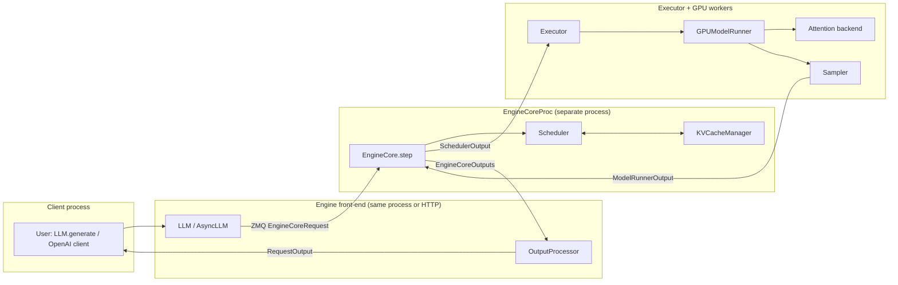
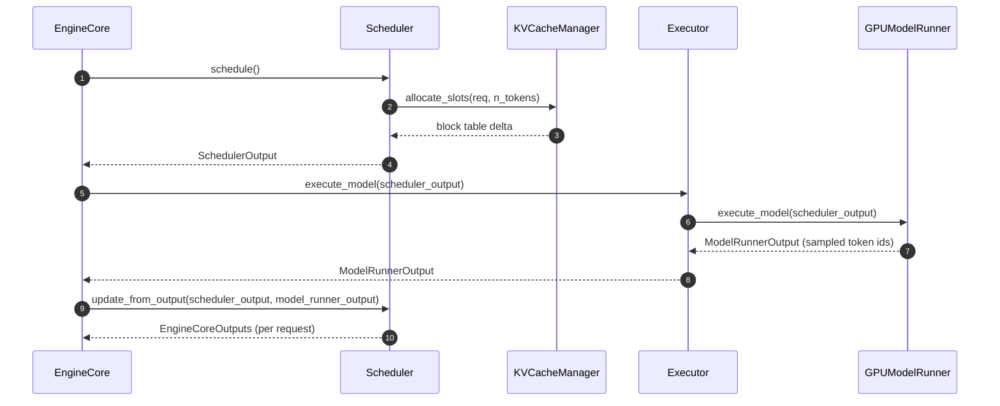
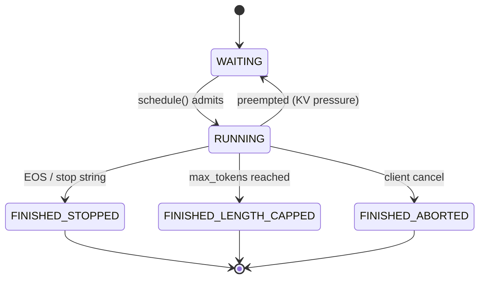
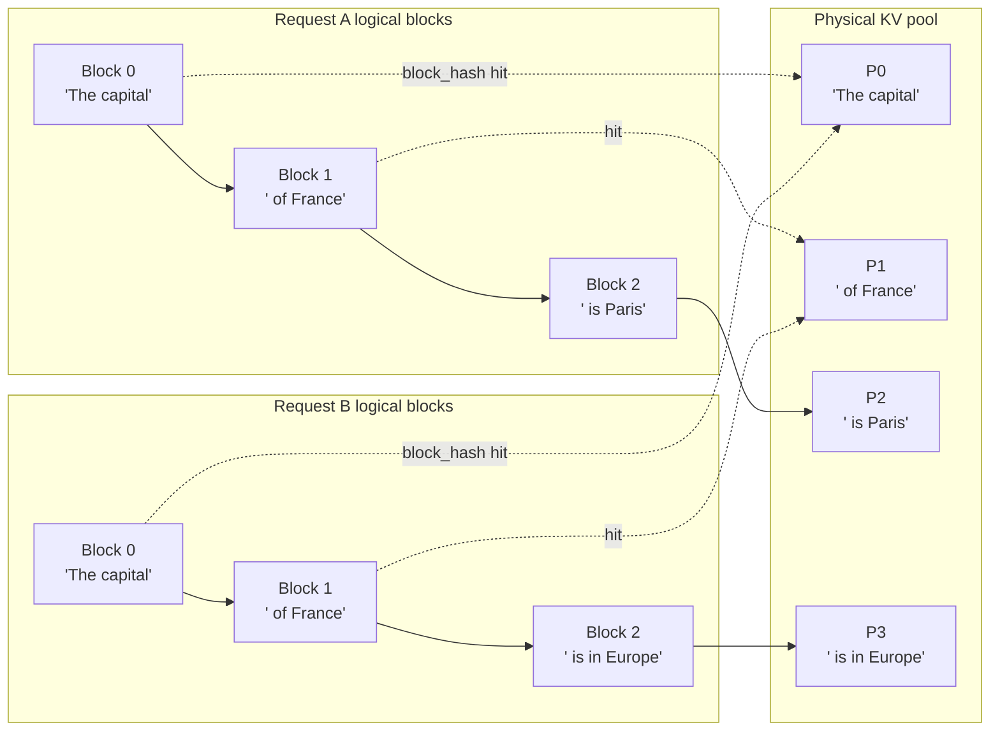
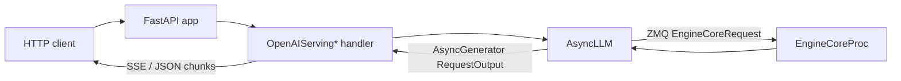

# vLLM Hacker's Guide

> **Scope:** a code-first tour of the **V1 engine** as it exists on
> `vllm-project/vllm` **v0.21.0** (released May 15, 2026). Inspired by the
> September 2025 blog post
> [*Inside vLLM: Anatomy of a High-Throughput LLM Inference System*](https://blog.vllm.ai/2025/09/05/anatomy-of-vllm.html),
> updated to the current code and paired with a `hacks/` directory of
> runnable scripts that exercise each subsystem in isolation.
>
> If you only want one sentence: every request enters via
> [`vllm/entrypoints/llm.py:106`](vllm/entrypoints/llm.py) (`class LLM`),
> is forwarded into the V1 engine, gets scheduled by
> [`vllm/v1/core/sched/scheduler.py:62`](vllm/v1/core/sched/scheduler.py)
> (`class Scheduler`), is executed by
> [`vllm/v1/worker/gpu_model_runner.py:399`](vllm/v1/worker/gpu_model_runner.py)
> (`class GPUModelRunner`), and streams back through
> [`vllm/v1/engine/output_processor.py:438`](vllm/v1/engine/output_processor.py)
> (`class OutputProcessor`). Everything else is detail.

---

## Table of contents

1. [How to read this guide](#1-how-to-read-this-guide)
2. [30-second architecture](#2-30-second-architecture)
3. [`LLM.generate()` — the entry point](#3-llmgenerate--the-entry-point)
4. [EngineCore: the step loop](#4-enginecore-the-step-loop)
5. [The Scheduler](#5-the-scheduler)
6. [Paged attention & the KV cache manager](#6-paged-attention--the-kv-cache-manager)
7. [Continuous batching, in code](#7-continuous-batching-in-code)
8. [Attention backends](#8-attention-backends)
9. [Sampling](#9-sampling)
10. [Request lifecycle & output](#10-request-lifecycle--output)
11. [Workers & executors](#11-workers--executors)
12. [Multi-GPU / distributed](#12-multi-gpu--distributed)
13. [Advanced features](#13-advanced-features)
14. [The serving layer](#14-the-serving-layer)
15. [Where to go next](#15-where-to-go-next)
16. [Hands-on hacks](#16-hands-on-hacks)
17. [Contributing](#17-contributing)

---

## 1. How to read this guide

**Prerequisites.** A working PyTorch install, a CUDA-capable GPU helps
but is not required for most of the `hacks/` scripts, and the
contributor environment described in [`AGENTS.md`](AGENTS.md):

```bash
curl -LsSf https://astral.sh/uv/install.sh | sh
uv venv --python 3.12 && source .venv/bin/activate
VLLM_USE_PRECOMPILED=1 uv pip install -e . --torch-backend=auto
uv pip install -r requirements/lint.txt && pre-commit install
```

**Running example.** Throughout the guide we trace this five-line
program through the engine:

```python
from vllm import LLM, SamplingParams

llm = LLM(model="facebook/opt-125m")
outs = llm.generate(["The capital of France is"], SamplingParams(max_tokens=8))
print(outs[0].outputs[0].text)
```

Each section ends with a **▶ Try it** pointer to a script in `hacks/`
that lets you exercise the component **without booting the whole
engine** — no model weights, no CUDA in most cases.

**Conventions.** Code references use the form
`vllm/path/to/file.py:LINE` and link into the tree at the
**current** SHA on disk. Line numbers drift; treat them as hints and
search by the named symbol if a line moves.

---

## 2. 30-second architecture



The boxes correspond to concrete files:

| Box | File | Symbol |
| --- | --- | --- |
| `LLM` / `AsyncLLM` | [`vllm/entrypoints/llm.py:106`](vllm/entrypoints/llm.py) / [`vllm/v1/engine/async_llm.py:70`](vllm/v1/engine/async_llm.py) | `class LLM` / `class AsyncLLM` |
| `EngineCoreProc` | [`vllm/v1/engine/core.py:810`](vllm/v1/engine/core.py) | `class EngineCoreProc` |
| `EngineCore.step` | [`vllm/v1/engine/core.py:406`](vllm/v1/engine/core.py) | `def step` |
| `Scheduler` | [`vllm/v1/core/sched/scheduler.py:62`](vllm/v1/core/sched/scheduler.py) | `class Scheduler` |
| `KVCacheManager` | [`vllm/v1/core/kv_cache_manager.py:106`](vllm/v1/core/kv_cache_manager.py) | `class KVCacheManager` |
| `Executor` | [`vllm/v1/executor/abstract.py:37`](vllm/v1/executor/abstract.py) | `class Executor` (ABC) |
| `GPUModelRunner` | [`vllm/v1/worker/gpu_model_runner.py:399`](vllm/v1/worker/gpu_model_runner.py) | `class GPUModelRunner` |
| `Sampler` | [`vllm/v1/sample/sampler.py:21`](vllm/v1/sample/sampler.py) | `class Sampler` |
| `OutputProcessor` | [`vllm/v1/engine/output_processor.py:438`](vllm/v1/engine/output_processor.py) | `class OutputProcessor` |

---

## 3. `LLM.generate()` — the entry point

The user-facing `LLM` wraps an inner `LLMEngine`, which in V1 is a thin
adapter that talks to an `EngineCore` (either in-process or over ZMQ).

- [`vllm/entrypoints/llm.py:106`](vllm/entrypoints/llm.py) — `class LLM`.
- [`vllm/entrypoints/llm.py:446`](vllm/entrypoints/llm.py) — `def generate(...)`. It:
  1. Validates prompts / sampling params.
  2. Calls `_validate_and_add_requests` which tokenizes each prompt and
     calls `self.llm_engine.add_request(...)`.
  3. Pumps `_run_engine()` until every added request finishes, then
     returns a list of `RequestOutput` ordered by submission.
- [`vllm/v1/engine/llm_engine.py:47`](vllm/v1/engine/llm_engine.py) —
  `class LLMEngine`, the V1 sync wrapper.
- [`vllm/v1/engine/async_llm.py:70`](vllm/v1/engine/async_llm.py) —
  `class AsyncLLM`, the async sibling used by the OpenAI server.
  - `add_request` ([line 280](vllm/v1/engine/async_llm.py)) tokenizes
    and forwards an `EngineCoreRequest`.
  - `generate` ([line 524](vllm/v1/engine/async_llm.py)) is an
    `AsyncGenerator[RequestOutput, None]` — it yields each
    incremental output until the request is `FINISHED_*`.

**Offline vs. online.** Both `LLMEngine` and `AsyncLLM` ultimately push
`EngineCoreRequest` objects over the same boundary. The difference is
back-pressure and threading: `LLMEngine` drives the loop synchronously,
`AsyncLLM` yields control to asyncio between steps.

▶ Try it: [`hacks/01_llm_smoke.py`](hacks/01_llm_smoke.py) (loads a real
model — gated by `VLLM_HACK_RUN_MODEL=1`).

---

## 4. EngineCore: the step loop

`EngineCore` ([`vllm/v1/engine/core.py:91`](vllm/v1/engine/core.py))
owns the scheduler, the KV cache manager, and the executor. It exposes
two methods worth knowing:

- `add_request` ([line 315](vllm/v1/engine/core.py)) — validates inputs,
  builds a `Request`, and pushes it into the scheduler's waiting queue.
- `step` ([line 406](vllm/v1/engine/core.py)) — one tick of the engine.
  Always three stages:



`EngineCoreProc` ([line 810](vllm/v1/engine/core.py)) is the
multi-process variant; its `run_busy_loop`
([line 1168](vllm/v1/engine/core.py)) sits on a ZMQ socket, decodes
client requests, calls `step()`, and ships `EngineCoreOutputs` back. In
single-process / "uniproc" mode `LLMEngine` drives `step()` directly.

▶ Try it: [`hacks/12_engine_step.py`](hacks/12_engine_step.py) — drives
one full engine step end-to-end with a stub model, **zero CUDA**.

---

## 5. The Scheduler

The scheduler is the single most important file in V1.

- [`vllm/v1/core/sched/scheduler.py:62`](vllm/v1/core/sched/scheduler.py)
  — `class Scheduler(SchedulerInterface)`.
- [`vllm/v1/core/sched/interface.py`](vllm/v1/core/sched/interface.py)
  — the abstract base (`SchedulerInterface`).
- [`vllm/v1/core/sched/output.py`](vllm/v1/core/sched/output.py) —
  `SchedulerOutput` (the contract with the executor).

### What `schedule()` does

`Scheduler.schedule()`
([line 310](vllm/v1/core/sched/scheduler.py)) picks the next batch.
Mental model:

1. **Decode pass.** Walk every request in `self.running`; reserve one
   new KV block slot per request if needed (cap by token budget).
2. **Prefill pass.** Promote waiting requests into running if there's
   leftover budget and free KV blocks. If chunked prefill is on
   (`scheduler_config.enable_chunked_prefill`,
   check at [line 643](vllm/v1/core/sched/scheduler.py)), only chunk a
   prefix of the prompt that fits the remaining budget.
3. **Emit `SchedulerOutput`** — flat lists of token ids, slot mappings,
   and metadata that the worker turns straight into a single tensor.

### What `update_from_output()` does

`Scheduler.update_from_output()`
([line 1248](vllm/v1/core/sched/scheduler.py)) is the **feedback path**.
It appends sampled tokens to each running request, checks stop
conditions (EOS, `max_tokens`, stop strings), and frees KV blocks for
finished requests via `KVCacheManager.free`.

### Request status



Enum lives at [`vllm/v1/request.py:316`](vllm/v1/request.py).

▶ Try it:
- [`hacks/05_scheduler_step.py`](hacks/05_scheduler_step.py) — single
  scheduling tick with three synthetic requests.
- [`hacks/06_chunked_prefill.py`](hacks/06_chunked_prefill.py) — long
  prompt, small budget, watch the prompt slice.

---

## 6. Paged attention & the KV cache manager

Paged attention turns the KV cache into a **block allocator**: each
request owns a "block table" mapping logical block indices to physical
GPU memory blocks. Identical prefixes share physical blocks.

### Key files

- [`vllm/v1/core/kv_cache_manager.py:106`](vllm/v1/core/kv_cache_manager.py)
  — `class KVCacheManager`. The high-level API:
  - `allocate_slots(request, num_tokens)` ([line 225](vllm/v1/core/kv_cache_manager.py))
    — return a delta of newly assigned blocks; raises if the pool is
    full.
  - `free(request)` ([line 418](vllm/v1/core/kv_cache_manager.py)) —
    drop reference counts so blocks can be reused.
- [`vllm/v1/core/block_pool.py:130`](vllm/v1/core/block_pool.py) —
  `class BlockPool`. The low-level free-list / LRU implementation.
- [`vllm/v1/core/kv_cache_utils.py:40`](vllm/v1/core/kv_cache_utils.py)
  — `BlockHash = NewType("BlockHash", bytes)` and
  `BlockHashWithGroupId` ([line 45](vllm/v1/core/kv_cache_utils.py)).
- [`vllm/v1/core/kv_cache_utils.py:635`](vllm/v1/core/kv_cache_utils.py)
  — `def get_request_block_hasher(...)`, the factory that produces a
  per-request hasher used for prefix-cache lookups.

### Prefix sharing, visually



The hash function (`get_request_block_hasher`) hashes the full token
sequence ending at each block boundary, with a stable per-cache-group
salt (`BlockHashWithGroupId`) so multiple cache groups (e.g. cross-
attention KV) can share the pool without collision.

### Eviction policy

When the pool runs out, the `BlockPool` evicts the **least-recently-
used unreferenced block** ([`block_pool.py`](vllm/v1/core/block_pool.py)
`free_blocks` / `_evict_*` helpers). Reference counts are bumped each
time a logical block points at a physical block, so blocks shared by
live requests are never evicted.

▶ Try it:
- [`hacks/03_kv_cache_manager.py`](hacks/03_kv_cache_manager.py) —
  allocate / share / free synthetic requests.
- [`hacks/04_prefix_cache_hashing.py`](hacks/04_prefix_cache_hashing.py)
  — show two prompts hash to the same prefix blocks.

---

## 7. Continuous batching, in code

V1 implements "continuous batching" not by per-request batching, but by
**flattening the entire batch into a single 1-D token sequence per
step**. The trick is in the `SchedulerOutput`:

- A single concatenated `token_ids` tensor for the step.
- A `query_start_loc` / `seq_lens` pair telling the attention kernel
  where each request's tokens live in the flat tensor.
- Block tables packed as a 2-D tensor `(num_reqs, max_blocks)`.

You can see this packing in
[`vllm/v1/worker/gpu_input_batch.py`](vllm/v1/worker/gpu_input_batch.py)
(it builds the actual tensors) and read about why this is correct in
[`docs/design/paged_attention.md`](docs/design/paged_attention.md). The
attention backends (next section) accept this layout natively.

**Why this matters for hackers:** prefill and decode share the *same*
forward pass. There is no separate "prefill model" — the scheduler
just packs prefill tokens and decode tokens into one tensor and the
attention kernel handles both via the block table.

---

## 8. Attention backends

Attention backends are selected at engine init based on hardware,
dtype, head size, and whether you've requested anything fancy
(MLA, mamba, etc.).

- [`vllm/v1/attention/backend.py`](vllm/v1/attention/backend.py) —
  `AttentionBackend` (registry surface) and `AttentionImpl` (kernel
  base class).
- [`vllm/v1/attention/selector.py:52`](vllm/v1/attention/selector.py) —
  `def get_attn_backend(...)`. Reads
  `VLLM_ATTENTION_BACKEND` env var, dtype, device, and head size, then
  picks one of:

| Backend file | Use case |
| --- | --- |
| [`backends/flash_attn.py`](vllm/v1/attention/backends/flash_attn.py) | NVIDIA, generic |
| [`backends/flashinfer.py`](vllm/v1/attention/backends/flashinfer.py) | NVIDIA, lower decode latency |
| [`backends/triton_attn.py`](vllm/v1/attention/backends/triton_attn.py) | Triton kernels, broader hw |
| [`backends/flex_attention.py`](vllm/v1/attention/backends/flex_attention.py) | PyTorch 2.5+ FlexAttention |
| [`backends/rocm_aiter_fa.py`](vllm/v1/attention/backends/rocm_aiter_fa.py), [`rocm_attn.py`](vllm/v1/attention/backends/rocm_attn.py) | AMD ROCm |
| [`backends/cpu_attn.py`](vllm/v1/attention/backends/cpu_attn.py) | CPU fallback |
| [`backends/mamba*_attn.py`](vllm/v1/attention/backends/) | State-space models |
| [`backends/mla/`](vllm/v1/attention/backends/mla/) | Multi-head Latent Attention (DeepSeek) |

Cross-link: [`docs/design/attention_backends.md`](docs/design/attention_backends.md)
covers what authoring a new backend looks like.

▶ Try it: [`hacks/09_attention_backend_select.py`](hacks/09_attention_backend_select.py)
— print the backend chosen for various `(head_size, dtype, device)` tuples.

---

## 9. Sampling

[`vllm/v1/sample/sampler.py:21`](vllm/v1/sample/sampler.py) defines
`class Sampler(nn.Module)`. It receives raw logits from the
`GPUModelRunner`, runs them through a fixed pipeline:

1. Apply logits processors (from
   [`vllm/v1/sample/logits_processor/`](vllm/v1/sample/logits_processor/)).
2. Apply penalties
   ([`vllm/v1/sample/ops/penalties.py`](vllm/v1/sample/ops/penalties.py)).
3. Apply bad-words mask
   ([`ops/bad_words.py`](vllm/v1/sample/ops/bad_words.py)).
4. Apply temperature / top-k / top-p
   ([`ops/topk_topp_sampler.py`](vllm/v1/sample/ops/topk_topp_sampler.py)).
5. Sample (multinomial or argmax depending on temperature).
6. Compute logprobs if requested
   ([`ops/logprobs.py`](vllm/v1/sample/ops/logprobs.py)).

For speculative decoding there is a parallel
[`vllm/v1/sample/rejection_sampler.py`](vllm/v1/sample/rejection_sampler.py)
that accepts/rejects drafts from a small proposer model.

Cross-link: [`docs/design/logits_processors.md`](docs/design/logits_processors.md).

▶ Try it:
- [`hacks/07_sampler.py`](hacks/07_sampler.py) — hand-crafted logits
  through every knob.
- [`hacks/08_logits_processor.py`](hacks/08_logits_processor.py) — a
  20-line custom processor that bans one token.

---

## 10. Request lifecycle & output

A `Request` ([`vllm/v1/request.py:59`](vllm/v1/request.py)) carries
everything about an in-flight generation: tokens so far, sampling
params, multi-modal inputs, structured-output state, KV block table,
arrival time, and current `RequestStatus`
([line 316](vllm/v1/request.py)).

`StreamingUpdate` ([`vllm/v1/request.py:33`](vllm/v1/request.py)) is the
small structure that gets fanned out per step — newly sampled token
ids, finish reason if any, and any logprobs.

On the way *out*,
[`vllm/v1/engine/output_processor.py:438`](vllm/v1/engine/output_processor.py)
— `class OutputProcessor` — owns one
`RequestOutputCollector` per active request. It:

- Detokenizes new token ids (handles partial-utf8 boundaries).
- Stitches streaming chunks for the OpenAI API.
- Decides when a request is "done from the client's perspective",
  even if the engine kept going for a step (e.g. EOS-on-the-wire).

▶ Try it:
- [`hacks/02_request_lifecycle.py`](hacks/02_request_lifecycle.py) —
  walk a `Request` through the `RequestStatus` state machine.
- [`hacks/10_output_processor.py`](hacks/10_output_processor.py) —
  drive `OutputProcessor` with synthetic engine outputs.

---

## 11. Workers & executors

The **executor** owns one or more **workers**, each of which owns
one `GPUModelRunner`. The runner is what holds the actual `nn.Module`
and the CUDA graphs.

- [`vllm/v1/worker/gpu_model_runner.py:399`](vllm/v1/worker/gpu_model_runner.py)
  — `class GPUModelRunner`.
- [`vllm/v1/worker/gpu_model_runner.py:3855`](vllm/v1/worker/gpu_model_runner.py)
  — `def execute_model(scheduler_output)`. Steps it performs:
  1. Build input tensors from `SchedulerOutput` (via
     [`gpu_input_batch.py`](vllm/v1/worker/gpu_input_batch.py)).
  2. Call the model forward — replays a CUDA graph if the batch shape
     matches a captured one, otherwise eager.
  3. Hand logits to the `Sampler`.
  4. Return `ModelRunnerOutput` (sampled tokens + optional logprobs).
- [`vllm/v1/worker/gpu_worker.py:783`](vllm/v1/worker/gpu_worker.py) —
  `def execute_model` on the worker is a thin shim that forwards to
  the runner and bridges CUDA streams to the executor IPC.
- [`vllm/v1/worker/worker_base.py`](vllm/v1/worker/worker_base.py) —
  `class WorkerBase` (the interface every backend implements).

Cross-link: [`docs/design/cuda_graphs.md`](docs/design/cuda_graphs.md)
explains how runners capture and replay graphs.

▶ Try it: [`hacks/11_executor_uniproc.py`](hacks/11_executor_uniproc.py).

---

## 12. Multi-GPU / distributed

Single-process and multi-process / Ray all sit behind one ABC:

- [`vllm/v1/executor/abstract.py:37`](vllm/v1/executor/abstract.py) —
  `class Executor(ABC)`.
- [`vllm/v1/executor/uniproc_executor.py:45`](vllm/v1/executor/uniproc_executor.py)
  — `class UniProcExecutor` (single process, easiest to debug).
- [`vllm/v1/executor/multiproc_executor.py:102`](vllm/v1/executor/multiproc_executor.py)
  — `class MultiprocExecutor` (one OS process per GPU).
- [`vllm/v1/executor/ray_executor.py:64`](vllm/v1/executor/ray_executor.py)
  — `class RayDistributedExecutor` (multi-node).

The cross-process boundary between the engine front-end and
`EngineCoreProc` is mediated by
[`vllm/v1/engine/core_client.py`](vllm/v1/engine/core_client.py) —
`EngineCoreClient` is the ZMQ stub used by `AsyncLLM`.

Cross-link: [`docs/design/multiprocessing.md`](docs/design/multiprocessing.md).

---

## 13. Advanced features

These all reuse the same scheduler / KV manager / sampler — they
**don't** fork the request path.

### Chunked prefill
Already in §5. The knob is
`scheduler_config.enable_chunked_prefill`
([line 643](vllm/v1/core/sched/scheduler.py)). It lets a long prompt's
prefill be sliced across multiple engine steps so it doesn't starve
decode requests.

### Prefix caching
Already in §6. Implemented as block-hash-based deduplication in
`KVCacheManager` + `BlockPool`, with hashing in
[`kv_cache_utils.py:635`](vllm/v1/core/kv_cache_utils.py).
Cross-link: [`docs/design/prefix_caching.md`](docs/design/prefix_caching.md).

### Speculative decoding
Drafters live in [`vllm/v1/spec_decode/`](vllm/v1/spec_decode/):

- [`eagle.py`](vllm/v1/spec_decode/eagle.py) — EAGLE drafter.
- [`medusa.py`](vllm/v1/spec_decode/medusa.py) — Medusa heads.
- [`ngram_proposer.py`](vllm/v1/spec_decode/ngram_proposer.py) /
  [`ngram_proposer_gpu.py`](vllm/v1/spec_decode/ngram_proposer_gpu.py)
  — N-gram match drafting.
- [`draft_model.py`](vllm/v1/spec_decode/draft_model.py),
  [`suffix_decoding.py`](vllm/v1/spec_decode/suffix_decoding.py),
  [`gemma4.py`](vllm/v1/spec_decode/gemma4.py) — newer variants.
- Acceptance/rejection in
  [`vllm/v1/sample/rejection_sampler.py`](vllm/v1/sample/rejection_sampler.py).

### Structured / guided decoding
[`vllm/v1/structured_output/__init__.py:35`](vllm/v1/structured_output/__init__.py)
— `class StructuredOutputManager`. Plug-in backends:

- [`backend_xgrammar.py`](vllm/v1/structured_output/backend_xgrammar.py)
- [`backend_outlines.py`](vllm/v1/structured_output/backend_outlines.py)
- [`backend_guidance.py`](vllm/v1/structured_output/backend_guidance.py)
- [`backend_lm_format_enforcer.py`](vllm/v1/structured_output/backend_lm_format_enforcer.py)

The manager produces logit masks each step that the `Sampler`'s logits-
processor chain applies — same hook point as user processors.

---

## 14. The serving layer



- [`vllm/entrypoints/openai/api_server.py:78`](vllm/entrypoints/openai/api_server.py)
  — `async def build_async_engine_client(...)`. Builds the `AsyncLLM`
  process and wires up shutdown.
- [`vllm/entrypoints/openai/api_server.py:157`](vllm/entrypoints/openai/api_server.py)
  — `def build_app(...)`. The FastAPI app factory; mounts the
  `/v1/chat/completions`, `/v1/completions`, `/v1/embeddings` routes.
- [`vllm/entrypoints/openai/api_server.py:317`](vllm/entrypoints/openai/api_server.py)
  — `async def init_app_state(...)`. Attaches `OpenAIServingChat`,
  `OpenAIServingCompletion`, etc. to `app.state`, each of which holds
  a reference to the `AsyncLLM`.

Each `OpenAIServing*` class lives next door in
`vllm/entrypoints/openai/serving_*.py`; they're the right place to
read if you're tracing why a particular field on the OpenAI API maps to
a particular `SamplingParams` field.

---

## 15. Where to go next

In-tree design docs that go deeper than this guide:

- [`docs/design/arch_overview.md`](docs/design/arch_overview.md) —
  layered architecture diagram.
- [`docs/design/vllm_architecture.md`](docs/design/vllm_architecture.md)
  — long-form architecture reference (point-in-time snapshot, verify
  paths against current source).
- [`docs/design/paged_attention.md`](docs/design/paged_attention.md) /
  [`docs/design/paged_attention_demo.md`](docs/design/paged_attention_demo.md)
  — paged-attention internals.
- [`docs/design/prefix_caching.md`](docs/design/prefix_caching.md) —
  the hash-based prefix-cache algorithm.
- [`docs/design/attention_backends.md`](docs/design/attention_backends.md)
  — backend author's guide.
- [`docs/design/cuda_graphs.md`](docs/design/cuda_graphs.md),
  [`docs/design/cuda_graphs_multimodal.md`](docs/design/cuda_graphs_multimodal.md)
  — CUDA-graph capture.
- [`docs/design/model_runner_v2.md`](docs/design/model_runner_v2.md) —
  model runner internals.
- [`docs/design/logits_processors.md`](docs/design/logits_processors.md)
  — sampling/logits processors.
- [`docs/design/multiprocessing.md`](docs/design/multiprocessing.md) —
  worker/executor IPC.
- [`docs/design/hybrid_kv_cache_manager.md`](docs/design/hybrid_kv_cache_manager.md)
  — hybrid (e.g. mamba + attention) cache layout.
- [`docs/usage/v1_guide.md`](docs/usage/v1_guide.md) — feature-support
  matrix (what works on V1 vs. not yet).

---

## 16. Hands-on hacks

[`hacks/`](hacks/) is a directory of small, runnable scripts that
exercise each subsystem **in isolation**. Most need no model weights,
no CUDA, and finish in <10 s on a laptop CPU. Read them top-down —
each script is paired with a section of this guide.

| # | Script | Pairs with | One-liner |
| --- | --- | --- | --- |
| 01 | [`hacks/01_llm_smoke.py`](hacks/01_llm_smoke.py) | §3 | Full pipeline on `facebook/opt-125m`. Needs `VLLM_HACK_RUN_MODEL=1`. |
| 02 | [`hacks/02_request_lifecycle.py`](hacks/02_request_lifecycle.py) | §10 | Walk `Request` through `RequestStatus`. |
| 03 | [`hacks/03_kv_cache_manager.py`](hacks/03_kv_cache_manager.py) | §6 | Allocate / share / free blocks across two requests with a common prefix. |
| 04 | [`hacks/04_prefix_cache_hashing.py`](hacks/04_prefix_cache_hashing.py) | §6 | Show two prompts hash to identical prefix blocks. |
| 05 | [`hacks/05_scheduler_step.py`](hacks/05_scheduler_step.py) | §5 | One `schedule()` tick with three synthetic requests. |
| 06 | [`hacks/06_chunked_prefill.py`](hacks/06_chunked_prefill.py) | §5 | Long prompt sliced across multiple steps. |
| 07 | [`hacks/07_sampler.py`](hacks/07_sampler.py) | §9 | Logits through temperature, top-k, top-p, penalties side by side. |
| 08 | [`hacks/08_logits_processor.py`](hacks/08_logits_processor.py) | §9 | A 20-line custom processor that bans one token. |
| 09 | [`hacks/09_attention_backend_select.py`](hacks/09_attention_backend_select.py) | §8 | Print backend chosen for various `(head_size, dtype, device)` tuples. |
| 10 | [`hacks/10_output_processor.py`](hacks/10_output_processor.py) | §10 | Feed synthetic `ModelRunnerOutput` to the detokenizer. |
| 11 | [`hacks/11_executor_uniproc.py`](hacks/11_executor_uniproc.py) | §11 | `UniProcExecutor` with a no-op worker. |
| 12 | [`hacks/12_engine_step.py`](hacks/12_engine_step.py) | §4 | **Capstone:** wire 03 + 05 + 07 + 10 into one full engine step, zero CUDA. |
| 13 | [`hacks/13_async_llm_stream.py`](hacks/13_async_llm_stream.py) | §3 | Stream tokens from a real tiny model. Needs `VLLM_HACK_RUN_MODEL=1`. |

Shared stubs (`FakeModelRunner`, `tiny_kv_cache_config()`, …) live in
[`hacks/_stubs.py`](hacks/_stubs.py).

Run any one with `.venv/bin/python hacks/05_scheduler_step.py`. The
CI smoke test [`tests/hacks/test_hacks_smoke.py`](tests/hacks/test_hacks_smoke.py)
runs every non-model-loading script and asserts exit code 0 — if you
change an internal signature and the hacks stop running, that's the
first signal.

---

## 17. Contributing

Read [`AGENTS.md`](AGENTS.md) **before** opening a PR. Highlights:

- Duplicate-work checks (`gh issue view`, `gh pr list`) are mandatory.
- No "low-value busywork" PRs — bundle mechanical cleanups with
  substantive work.
- All Python via `uv` and `.venv/bin/python`, never system `pip`.
- Run `pre-commit run --all-files` and the relevant `pytest`s before
  pushing.
- AI-assisted PRs must declare it in the PR body and include the
  trailers from `AGENTS.md` ("Co-authored-by: Claude", etc.).

Welcome aboard.
